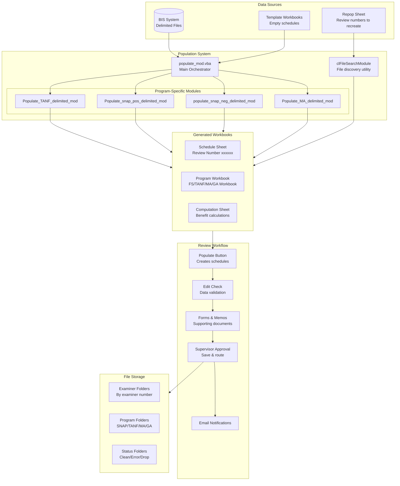
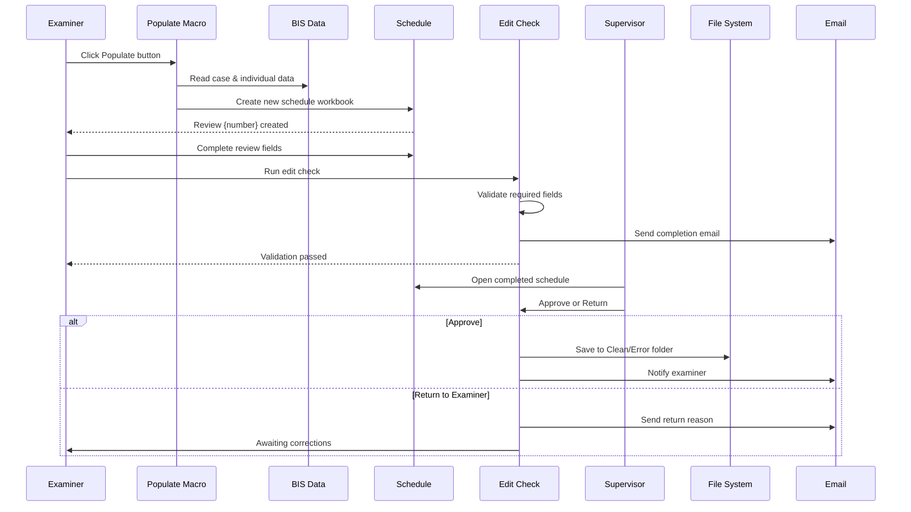

# Project Overview - QC Case Review Populate Macros

## Purpose

This VBA macro system automates the Quality Control (QC) case review process for Pennsylvania's Department of Human Services. It creates and manages Excel workbooks used by QC reviewers to examine public assistance cases for accuracy and compliance.

## Programs Supported

The system handles reviews for four major public assistance programs:

| Program | Description | Review Types |
|---------|-------------|--------------|
| **SNAP** | Supplemental Nutrition Assistance Program (Food Stamps) | Positive (50/51/55), Negative (60/61/65/66) |
| **TANF** | Temporary Assistance for Needy Families | Standard (14xx) |
| **GA** | General Assistance (State-funded cash assistance) | Standard (9xxx) |
| **MA** | Medical Assistance (Medicaid) | Positive (20/21), Negative (80/81/82/83), PE (24) |

## System Architecture



## File Structure

### Primary Workbook: `Populate.xlsm`

The main workbook containing all VBA modules, forms, and control sheets:

```
Populate.xlsm
├── Modules
│   ├── populate_mod.vba          # Main orchestration
│   ├── repopulate_mod.vba        # Recreate existing workbooks
│   ├── Populate_TANF_delimited_mod.vba
│   ├── Populate_snap_pos_delimited_mod.vba
│   ├── populate_snap_neg_delimited_mod.vba
│   ├── Populate_MA_delimited_mod.vba
│   ├── Module1.vba                # Supervisor/clerical approval
│   ├── Module3.vba                # Edit checking & emails
│   ├── Module2/4/5/11.vba        # Supporting utilities
│   ├── Finding_Memo.vba          # Findings memo generation
│   ├── CashMemos.vba             # Memo templates
│   ├── Drop.vba                  # Clear schedule data
│   └── CAO_Appointment.vba       # Appointment letters
├── UserForms
│   ├── SelectForms.frm           # Memo/form selection
│   ├── SelectDate.frm            # Date picker
│   ├── SelectTime.frm            # Time picker
│   ├── UserForm1/2/3.frm         # Program-specific forms
│   ├── MASelectForms.frm         # MA-specific forms
│   └── GAUserForm1/2.frm         # GA-specific forms
├── Class Modules
│   └── clFileSearchModule.vba    # Custom file search
└── Worksheets
    ├── repop                      # Repopulation control sheet
    └── (various data sheets)
```

### Network Path Structure

The system depends on a mapped network drive structure:

```
{Drive Letter}:\DQC\
├── Schedules by Examiner Number\
│   ├── {Examiner Name} - {Number}\
│   │   ├── SNAP Positive\
│   │   │   └── Review Month {Month} {Year}\
│   │   │       └── {Review Number} - {Case Details}\
│   │   │           └── Review Number {####} Month {YYYYMM} Examiner {##}.xlsm
│   │   ├── SNAP Negative\
│   │   ├── TANF\
│   │   ├── GA\
│   │   ├── MA Positive\
│   │   │   ├── (Active reviews)
│   │   │   └── FFY {Year} - {#}\  # Archived reviews
│   │   ├── MA Negative\
│   │   └── MA PE\
│   └── Previous Year Schedules\
├── SE Clerical Schedules\
│   └── {Program}\
│       ├── Clean\
│       ├── Error\
│       └── Drop\
├── HBG Clerical Schedules\
├── Pgh Clerical Schedules\
├── QCMIS Schedules\
└── Finding Memo\
    └── Finding Memo Data Source.xlsx
```

## Network Drive Detection

The system automatically detects the mapped network drive using WScript.Network:

```vb
' Searches for UNC path: \\hsedcprapfpp001\oim\pwimdaubts04\data\stat
' Accepts variations:
'   - \stat\dqc
'   - \stat (appends \DQC\)
```

If the network drive is not found, macros display an error and halt execution.

## Prerequisites

### Software Requirements

1. **Microsoft Excel** (2010 or later recommended)
   - Macro security set to enable VBA macros
   - Trust access to VBA project object model (for repopulate)

2. **Network Access**
   - Mapped drive to `\\hsedcprapfpp001\oim\pwimdaubts04\data\stat\dqc`
   - Read/write permissions to examiner folders

3. **Microsoft Outlook** (for email notifications)
   - Configured email account
   - Outlook integration enabled

### VBA References Required

- Microsoft Scripting Runtime (for FileSystemObject)
- Microsoft Outlook Object Library (for email)
- Visual Basic For Applications Extensibility (for repopulate module copying)

### Data Source Requirements

**BIS Delimited Files** must contain:
- `Case` worksheet with case-level information
- `Individual` worksheet with person-level information
- Pipe-delimited (|) or tab-delimited format
- Review numbers in column C

## Key Concepts

### Review Numbers

Review numbers follow a structured format indicating program and type:

| Prefix | Program | Type |
|--------|---------|------|
| 50, 51, 55 | SNAP | Positive (active participation) |
| 60, 61, 65, 66 | SNAP | Negative (denial/termination) |
| 14xx | TANF | Standard review |
| 20, 21, 23 | MA | Positive (active coverage) |
| 24 | MA | Presumptive Eligibility |
| 80, 81, 82, 83 | MA | Negative (denial/termination) |
| 9xxx | GA | Standard review |

### Disposition Codes

Disposition indicates review outcome:

| Code | Meaning | Impact |
|------|---------|--------|
| 1 | Valid/Active | Full schedule completion required |
| 2+ | Denied/Terminated/Suspended | Limited fields required |

### Review Findings

Finding codes determine case status:

| Code | Status | Meaning |
|------|--------|---------|
| 1 | Clean | No errors found |
| 2 | Agency Error | Eligibility error |
| 3 | Payment Error | Benefit amount error |
| 4 | Both Error | Both eligibility and payment errors |

### Drop Cases

Cases may be "dropped" (excluded from QC) for various reasons:
- Client refuses cooperation
- Case cannot be located
- Insufficient documentation
- Outside QC review period

Drop cases have limited data entry requirements and different workflow.

## User Roles

### QC Examiners
- Populate schedules from BIS data
- Complete case reviews
- Enter findings and error details
- Submit to supervisor

### QC Supervisors  
- Review completed schedules
- Approve or return to examiner
- Route files to appropriate folders
- Trigger email notifications

### Clerical Staff
- Secondary approval step
- File management
- Administrative tasks

## Workflow Summary



## Integration Points

### BIS System
- **Source:** Pennsylvania Benefits Information System
- **Format:** Pipe or tab-delimited export files
- **Content:** Case demographics, household composition, income, benefits
- **Update Frequency:** Manual export by reviewers

### QCMIS Database (Future)
- Edit check V2 scripts prepare data for transfer to Access databases
- See `editCheckingMacros/WhatChanged.md` for optimization details
- Current production still uses V1 (inline processing)

### Outlook Email System
- Automated notifications on:
  - Schedule completion
  - Supervisor approval
  - Return to examiner
- Uses Finding Memo Data Source for supervisor/examiner lookup

## Common File Locations

| Purpose | Typical Location |
|---------|-----------------|
| Populate.xlsm | Examiner's local drive or network home |
| BIS delimited files | Variable (examiner downloads) |
| Completed schedules | `{DQC}\Schedules by Examiner Number\{Name}\{Program}\` |
| Clerical folders | `{DQC}\SE Clerical Schedules\{Program}\{Status}\` |
| QCMIS folders | `{DQC}\QCMIS Schedules\{Program}\{Status}\` |
| Finding Memo templates | `{DQC}\Finding Memo\` |

## Version History

### Current Production Version
- Edit check: V1 (original, slower but stable)
- Populate: Single main module with program-specific branches
- File search: Custom clFileSearchModule class

### V2 Optimization (Available)
- Edit check: Optimized with batch reads/writes, transactions
- Performance: 10-50x faster for large batches
- See `editCheckingMacros/WhatChanged.md` for details

The V2 optimizations have been developed but not yet deployed to production due to testing and training requirements.

## Support Contacts

Per code references:
- **Valerie** - Technical support
- **Nicole** - Technical support  
- **Finding Memo Data Source** - Contains supervisor/examiner email mappings

---

**Next:** [Populate Flow](02-populate-flow.md) - Detailed documentation of the schedule population process

