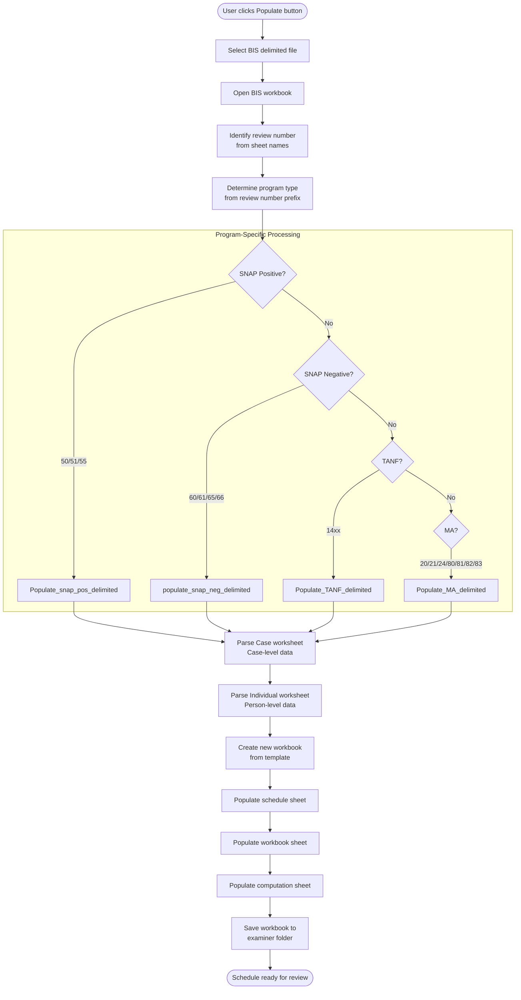

# Populate Flow - Schedule Creation Process

## Overview

The populate system reads BIS (Benefits Information System) delimited files and creates pre-filled QC review workbooks for examiners. It handles four major programs (SNAP, TANF, MA, GA) with program-specific logic for each.

## Entry Point

Population is triggered from the main `Populate.xlsm` workbook through a button that calls:

```vb
Sub populate_mod()  ' Main orchestration function
```

Location: `populateMacro/populate_mod.vba` (~3600 lines)

## Data Flow Overview



## BIS File Structure

### Input File Format

BIS files are Excel workbooks containing delimited data with two critical worksheets:

#### 1. Case Worksheet
Contains case-level information (one row per case):

| Column | Content | Example |
|--------|---------|---------|
| A | State/County codes | 42/10 |
| C | Review Number | 50123 |
| M | Application Date | 20231015 |
| X-AC | Certification period dates | Split across columns |
| AJ-AB | Contact info | Phone, address |
| AK | Benefit Amount | 250 |
| AU-AX | Housing/utility info | Rent, utility type |

**Format:** Pipe-delimited (\|) or tab-delimited

#### 2. Individual Worksheet
Contains person-level information (multiple rows per case):

| Column | Content | Example |
|--------|---------|---------|
| C | Review Number | 50123 |
| L | Line Number (person #) | 01 |
| N-Q | Name components | First, MI, Last, Suffix |
| R | Birth Date | 19851022 |
| S-T | Age and Relationship | 38, X (head) |
| U | SSN | 123456789 |
| V | Education Level | 12 |
| Y | Eligibility Status | EM (eligible member) |
| AE | ETP Code | 17 (employed) |
| AF | Citizenship | 1 (US born) |

**Key:** Rows are sorted by head of household first, then by line number

## Review Number Identification

```vb
' From main populate_mod
For Each ws In wb.Worksheets
    If Val(ws.Name) > 1000 Then
        review_number = ws.Name
        Exit For
    End If
Next
```

The system looks for worksheet names > 1000 (review numbers are 14xxx, 20xxx, 50xxx, etc.)

## Program Type Determination

Based on the first 2 digits of the review number:

```vb
Select Case Left(review_number, 2)
    Case "50", "51", "55"
        program = "FS Positive"      ' SNAP Positive
    Case "60", "61", "65", "66"
        program = "FS Negative"      ' SNAP Negative
    Case "14"
        program = "TANF"
    Case "20", "21"
        program = "MA Positive"
    Case "24"
        program = "MA PE"            ' Presumptive Eligibility
    Case "80", "81", "82", "83"
        program = "MA Negative"
End Select
```

## Data Extraction Process

### Finding Case Row

```vb
maxrow_bis_case = wb_bis.Worksheets("Case").Cells.Find(What:="*", _
    SearchDirection:=xlPrevious, SearchOrder:=xlByRows).Row

With wb_bis.Worksheets("Case").Range("C2:C" & maxrow_bis_case)
    Set case_row = .Find(Val(review_number), LookIn:=xlValues)
End With
```

### Finding Individual Rows

```vb
bis_ind_start_row = 0
For i = 2 To maxrow_bis_ind
    If Val(wb_bis.Worksheets("Individual").Range("C" & i)) = review_number Then
        bis_ind_start_row = i
        ' Continue until different review number found
    ElseIf bis_ind_start_row <> 0 Then
        bis_ind_stop_row = i - 1
        Exit For
    End If
Next
```

### Sorting Individuals

Ensures head of household appears first:

```vb
' Sort by Relationship (X = head of household) descending
wb_bis.Worksheets("Individual").Sort.SortFields.Add Key:=Range( _
    "T" & bis_ind_start_row & ":T" & bis_ind_stop_row), _
    SortOn:=xlSortOnValues, Order:=xlDescending

' Then sort by line number ascending (for non-heads)
wb_bis.Worksheets("Individual").Sort.SortFields.Add Key:=Range( _
    "L" & bis_ind_start_row + 1 & ":L" & bis_ind_stop_row), _
    SortOn:=xlSortOnValues, Order:=xlAscending
```

## Program-Specific Population

### SNAP Positive (`Populate_snap_pos_delimited_mod.vba`)

#### Template Worksheets Created
1. **{Review Number}** - Main schedule (Section 1-5)
2. **FS Workbook** - Supporting documentation
3. **FS Computation** - Benefit calculation

#### Key Mappings

**Case-level data:**
```vb
wb_sch.Worksheets("FS Workbook").Range("D16") = _
    wb_bis.Worksheets("Case").Range("AJ" & case_row.Row)  ' Phone

' Application date parsing (YYYYMMDD format)
temp = wb_bis.Worksheets("Case").Range("M" & case_row.Row)
appl_date = DateSerial(Val(Left(temp, 4)), Val(Mid(temp, 5, 2)), Val(Right(temp, 2)))

wb_sch.Worksheets("FS Workbook").Range("G20") = appl_date
```

**Person-level data (Section 4):**
```vb
write_row = 10  ' Starting row
For i = bis_ind_start_row To bis_ind_stop_row
    write_row = write_row + 1
    If write_row < 23 Then  ' Max 12 people
        ' Line number (formatted as 2 digits)
        wb_sch.Worksheets("FS Workbook").Range("K" & write_row) = _
            WorksheetFunction.Text(wb_bis.Worksheets("Individual").Range("L" & i), "00")
        
        ' Full name (concatenated)
        wb_sch.Worksheets("FS Workbook").Range("M" & write_row) = _
            Trim(wb_bis.Worksheets("Individual").Range("N" & i)) & " " & _
            Trim(wb_bis.Worksheets("Individual").Range("P" & i)) & " " & _
            Trim(wb_bis.Worksheets("Individual").Range("O" & i))
        
        ' Birth date parsing
        temp = wb_bis.Worksheets("Individual").Range("R" & i)
        wb_sch.Worksheets("FS Workbook").Range("Y" & write_row) = _
            DateSerial(Val(Left(temp, 4)), Val(Mid(temp, 5, 2)), Val(Right(temp, 2)))
    End If
Next i
```

**Income frequency conversion:**
```vb
income_freq = Array(0, 1, 4, 2, 2, 1, 0.5, 0.333333, 0.166667, 0.083333)
' Index matches BIS frequency code:
' 0=None, 1=Monthly, 2=Semi-monthly, 3=Bi-weekly, 4=Weekly, 
' 5=Hourly, 6=Quarterly, 7=Annually
```

#### Element Tracking

The system tracks various "elements" (data validation checkpoints):

```vb
' Element 110 - Check if all birthdates present
If birthdate = True Then
    wb_sch.Worksheets("FS Workbook").Shapes("CB 25").OLEFormat.Object.Value = 1
End If

' Element 111 - School attendance for 18+
If wb_bis.Worksheets("Individual").Range("S" & i) >= 18 And _
   wb_bis.Worksheets("Individual").Range("W" & i) <> 0 Then
    school = school & ", " & lnf(wb_bis.Worksheets("Individual").Range("L" & i))
End If

' Element 130 - Citizenship tracking
If wb_bis.Worksheets("Individual").Range("AF" & i) = 1 Then
    citizen = citizen & ", " & lnf(wb_bis.Worksheets("Individual").Range("L" & i))
End If
```

### SNAP Negative (`populate_snap_neg_delimited_mod.vba`)

Simpler than positive - only populates action information:

```vb
' Current date as Date Assigned
wb_sch.Worksheets(review_number).Range("C16") = _
    Application.WorksheetFunction.Text(Month(Date), "00")
wb_sch.Worksheets(review_number).Range("F16") = _
    Application.WorksheetFunction.Text(Day(Date), "00")
wb_sch.Worksheets(review_number).Range("I16") = Year(Date)

' Action Date from BIS
wb_sch.Worksheets(review_number).Range("S24") = _
    Mid(wb_bis.Worksheets(1).Range("K" & case_row.Row), 5, 2)

' Type of negativity (Denial, Termination, Suspension)
Select Case wb_bis.Worksheets(1).Range("C" & case_row.Row)
    Case "A"
        wb_sch.Worksheets(review_number).Range("AE24") = 1
        action_type = "Denial"
    Case "C"
        wb_sch.Worksheets(review_number).Range("AE24") = 2
        action_type = "Termination"
    Case "S"
        wb_sch.Worksheets(review_number).Range("AE24") = 3
        action_type = "Suspension"
End Select
```

### TANF (`Populate_TANF_delimited_mod.vba`)

#### Unique Features

**Section III - Household Composition:**
```vb
write_row = 10
For i = bis_ind_start_row To bis_ind_stop_row
    write_row = write_row + 1
    
    ' Line number
    wb_sch.Worksheets("TANF Workbook").Range("J" & write_row) = _
        WorksheetFunction.Text(wb_bis.Worksheets("Individual").Range("L" & i), "00")
    
    ' Individual category (benefit recipient vs household member)
    wb_sch.Worksheets("TANF Workbook").Range("AC" & write_row) = _
        wb_bis.Worksheets("Individual").Range("J" & i)
    
    ' TANF participation indicator
    If wb_bis.Worksheets("Individual").Range("AD" & i) = "ES" Or _
       wb_bis.Worksheets("Individual").Range("AD" & i) = "EC" Then
        wb_sch.Worksheets("TANF Workbook").Range("AI" & write_row) = "Yes"
    Else
        wb_sch.Worksheets("TANF Workbook").Range("AI" & write_row) = "No"
        household_size = household_size + 1
    End If
Next i
```

**Relationship Code Mapping (Section 4):**
```vb
Select Case UCase(wb_bis.Worksheets("Individual").Range("X" & i))
    Case "X  "  ' Head of Household
        If Val(wb_bis.Worksheets("Individual").Range("T" & i)) <= 19 Then
            wb_sch.Worksheets(review_number).Range("J" & j) = "02"  ' Minor head
        Else
            wb_sch.Worksheets(review_number).Range("J" & j) = "01"  ' Adult head
        End If
    Case "W  ", "H  ", "CLH", "CLW"  ' Spouse
        If wb_bis.Worksheets("Individual").Range("T" & i) <= 19 Then
            wb_sch.Worksheets(review_number).Range("J" & j) = "04"  ' Minor spouse
        Else
            wb_sch.Worksheets(review_number).Range("J" & j) = "03"  ' Adult spouse
        End If
    Case "F  ", "M  ", "SF ", "SM "  ' Parent
        wb_sch.Worksheets(review_number).Range("J" & j) = "05"
    Case "D  ", "S  "  ' Daughter, Son
        wb_sch.Worksheets(review_number).Range("J" & j) = "06"
    Case "SS ", "SD "  ' Stepson, Stepdaughter
        wb_sch.Worksheets(review_number).Range("J" & j) = "07"
    Case "NR "  ' Unrelated Person
        wb_sch.Worksheets(review_number).Range("J" & j) = "13"
    Case "GD ", "GS ", "GGS", "GGD"  ' Grandchild
        wb_sch.Worksheets(review_number).Range("J" & j) = "10"
    Case Else  ' Other related
        wb_sch.Worksheets(review_number).Range("J" & j) = "11"
End Select
```

### MA Positive (`Populate_MA_delimited_mod.vba`)

#### Special Date Handling

```vb
' Open date (most recent case opening)
open_date = DateSerial( _
    Val(wb_bis.Worksheets("Case").Range("AC" & case_row.Row)), _
    Val(wb_bis.Worksheets("Case").Range("AD" & case_row.Row)), _
    Val(wb_bis.Worksheets("Case").Range("AE" & case_row.Row)))
wb_sch.Worksheets("MA Workbook").Range("F25") = open_date

' Action date (most recent action on case)
action_date = DateSerial( _
    Val(wb_bis.Worksheets("Case").Range("AF" & case_row.Row)), _
    Val(wb_bis.Worksheets("Case").Range("AG" & case_row.Row)), _
    Val(wb_bis.Worksheets("Case").Range("AH" & case_row.Row)))
wb_sch.Worksheets("MA Workbook").Range("F27") = action_date
```

#### Section III - Person Information (Rows 51-73, step 2)

```vb
i = bis_ind_start_row - 1
For j = 51 To 73 Step 2
    i = i + 1
    wb_sch.Worksheets(review_number).Range("B" & j) = _
        WorksheetFunction.Text(wb_bis.Worksheets("Individual").Range("L" & i), "00")
    
    ' Relationship codes differ from TANF
    Select Case UCase(wb_bis.Worksheets("Individual").Range("T" & i))
        Case "X  "  ' Head
            If Val(wb_bis.Worksheets("Individual").Range("T" & i)) <= 19 Then
                wb_sch.Worksheets(review_number).Range("N" & j) = "02"
            Else
                wb_sch.Worksheets(review_number).Range("N" & j) = "01"
            End If
        Case "NR "  ' Unrelated
            wb_sch.Worksheets(review_number).Range("N" & j) = "20"  ' Different from TANF!
        Case Else
            wb_sch.Worksheets(review_number).Range("N" & j) = "14"  ' Generic "other"
    End Select
Next j
```

## Code Translation Tables

### Race Code Conversion

```vb
Select Case wb_bis.Worksheets("Individual").Range("V" & i)  ' BIS code
    Case 1  ' White
        wb_sch.Range("Y" & j) = 2  ' Schedule code
    Case 3  ' Black
        wb_sch.Range("Y" & j) = 5
    Case 4  ' Asian
        wb_sch.Range("Y" & j) = 4
    Case 5  ' Native American
        wb_sch.Range("Y" & j) = 1
    Case 6  ' Pacific Islander
        wb_sch.Range("Y" & j) = 9
    Case 7  ' Other
        wb_sch.Range("Y" & j) = 4
    Case 8  ' Hispanic/Unknown
        If wb_bis.Worksheets("Individual").Range("W" & i) = 2 Then
            wb_sch.Range("Y" & j) = 3  ' Hispanic
        Else
            wb_sch.Range("Y" & j) = 9  ' Unknown
        End If
End Select
```

### Citizenship Code Conversion

```vb
Select Case UCase(wb_bis.Worksheets("Individual").Range("AO" & i))  ' BIS
    Case 1  ' US Born
        wb_sch.Range("AB" & j) = "01"
    Case 4  ' Refugee
        wb_sch.Range("AB" & j) = "05"
    ' Cases 2, 3, 5, 6 not mapped (aliens, illegal)
End Select
```

### Gender Code Conversion

```vb
If wb_bis.Worksheets("Individual").Range("CO" & i) = "F" Then
    wb_sch.Range("M" & j) = "02"
ElseIf wb_bis.Worksheets("Individual").Range("CO" & i) = "M" Then
    wb_sch.Range("M" & j) = "01"
Else
    wb_sch.Range("M" & j) = ""
End If
```

## Workbook Creation and Saving

### Creating New Workbook

```vb
' Add new workbook
Set wb = Workbooks.Add

' Add worksheet named with review number
wb.Worksheets.Add
wb.Worksheets(1).Name = review_number

' Copy template structure (program-specific)
' Templates define the layout, formulas, and validation
```

### File Naming Convention

```
Review Number {######} Month {YYYYMM} Examiner {##}.xlsm
```

Examples:
- `Review Number 50123 Month 202310 Examiner 42.xlsm`
- `Review Number 14567 Month 202309 Examiner 07.xlsm`

### Save Location Logic

```vb
' Build path
pathdir = DLetter & "\Schedules by Examiner Number\"
PathStr = pathdir & exname & " - " & exnumstr & "\" & program & "\"

' For MA reviews, may include FFY archive subfolder
' FFY = Federal Fiscal Year (Oct-Sep)
If Month(sample_month) >= 10 Then  ' Oct, Nov, Dec
    FFY = Year(sample_month) + 1
Else  ' Jan-Sep
    FFY = Year(sample_month)
End If
```

## Error Handling

### Common Issues

**Review number not found:**
```vb
If case_row Is Nothing Then
    MsgBox "Review number " & review_number & " not found in BIS file!"
    Exit Sub
End If
```

**Missing individual records:**
```vb
If bis_ind_start_row = 0 Then
    MsgBox "No individual records found for review " & review_number
    Exit Sub
End If
```

**Invalid program type:**
```vb
Case Else
    MsgBox "Review Number " & reviewtxt & " is not a known QC Review number"
    Exit For
```

## Performance Considerations

### Current Implementation
- **Cell-by-cell reads:** Each field accessed individually from BIS
- **Direct writes:** Each schedule field written individually
- **No caching:** BIS data re-read for each access

### Typical Performance
- **Small case (1-2 people):** ~5-10 seconds
- **Large case (8+ people):** ~15-20 seconds
- **Batch of 100 cases:** Not supported (one at a time only)

### Optimization Opportunities
See [Optimizations & Recommendations](08-optimizations-recommendations.md) for details on:
- Array-based batch reading
- Template caching
- Pre-calculated mappings

## Usage Example

**Examiner Workflow:**

1. Export BIS data for review 50123
2. Open `Populate.xlsm`
3. Click Populate button
4. Select BIS file from file dialog
5. System identifies program (SNAP Positive)
6. Calls `Populate_snap_pos_delimited()`
7. Creates `Review Number 50123 Month 202310 Examiner 42.xlsm`
8. Saves to examiner's SNAP Positive folder
9. Opens workbook for examiner to complete review

---

**Next:** [Repopulate Flow](03-repopulate-flow.md) - How to recreate schedules and update modules

