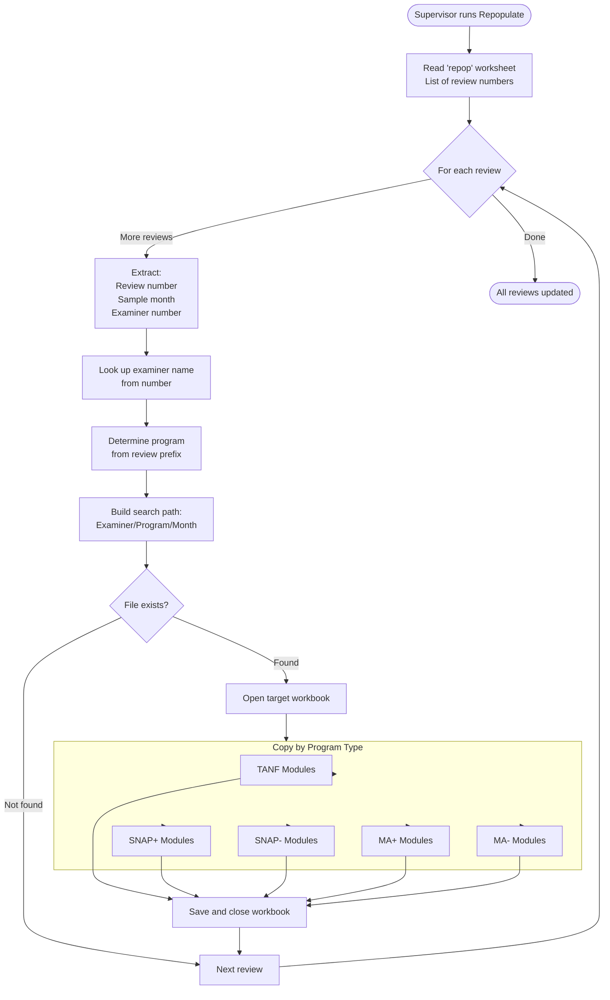

# Repopulate Flow - Schedule Recreation and Module Updates

## Overview

The repopulate system locates existing review workbooks and updates their VBA modules and forms. This is used when macros are updated and need to be deployed to previously created schedules without recreating all the data entry.

## Entry Point

Repopulation is triggered from the main `Populate.xlsm` workbook through a button that calls:

```vb
Sub repop_modules_forms()
```

Location: `populateMacro/populateMacro/repopulate_mod.vba` (275 lines)

## Purpose and Use Cases

### Why Repopulate?

**Problem:** Reviewers have completed data entry on schedules, but VBA code needs updating:
- Bug fixes in edit checking
- New memo templates
- Updated approval workflows  
- Additional UserForm features

**Solution:** Repopulate only the VBA modules/forms, preserving all data.

### What Gets Updated

✅ **Updated:**
- VBA standard modules
- UserForms and their code
- Class modules

❌ **Preserved:**
- All worksheet data (schedule fields, workbook sheets)
- Workbook formulas and formatting
- Examiner's entered values

## Data Flow



## Repop Sheet Structure

The "repop" worksheet in `Populate.xlsm` drives the process:

| Column | Content | Example |
|--------|---------|---------|
| E | Review Number | 50123 |
| F | Sample Month (YYYYMM) | 202310 |
| G | Examiner Number | 42 |
| K | Examiner Name | Smith, John |
| L | Examiner Number (lookup source) | 42 |

### Setup Requirements

```vb
' Row 1 contains headers
' Row 2+ contain review information
thissht.Range("E1").End(xlDown).Select
maxrow = ActiveCell.Row  ' Find last row with data

thissht.Range("L1").End(xlDown).Select
maxrowex = ActiveCell.Row  ' Find last examiner in lookup table
```

## Examiner Lookup Process

The system maintains an examiner lookup table to translate numbers to names:

```vb
' Find examiner name from number
exname = ""
For j = 2 To maxrowex
    If thissht.Range("G" & i) = thissht.Range("L" & j) Then
        exname = thissht.Range("K" & j)
        Exit For
    End If
Next j

If exname = "" Then
    MsgBox "No Examiner Name found for Review " & reviewtxt & _
           " and Examiner Number " & thissht.Range("G" & i)
End If
```

**Examiner Number Formatting:**
```vb
' Convert to 1 or 2 digit format (strip leading zeros)
exnumstr = WorksheetFunction.Text(thissht.Range("G" & i), "00")
If Left(exnumstr, 1) = "0" Then
    exnumstr = Right(exnumstr, 1)  ' 07 becomes 7
End If
```

## Program Determination

Same logic as populate - based on review number prefix:

```vb
Select Case Left(reviewtxt, 2)
    Case "50", "51", "55"
        program = "FS Positive"       ' SNAP Positive
    Case "60", "61", "65", "66"
        program = "FS Negative"       ' SNAP Negative
    Case "14"
        program = "TANF"
    Case "20", "21"
        program = "MA Positive"
    Case "24"
        program = "MA PE"             ' Presumptive Eligibility
    Case "80", "81", "82", "83"
        program = "MA Negative"
    Case Else
        MsgBox "Review Number " & reviewtxt & " is not a known QC Review number"
        Exit For
End Select
```

## Sample Month Conversion

Converts YYYYMM to month name for path building:

```vb
monthstr = thissht.Range("F" & i)  ' e.g., "202310"

Select Case Right(monthstr, 2)
    Case "01": mname = "January"
    Case "02": mname = "February"
    Case "03": mname = "March"
    Case "04": mname = "April"
    Case "05": mname = "May"
    Case "06": mname = "June"
    Case "07": mname = "July"
    Case "08": mname = "August"
    Case "09": mname = "September"
    Case "10": mname = "October"
    Case "11": mname = "November"
    Case "12": mname = "December"
End Select
```

## File Search Process

### Path Construction

```vb
PathStr = pathdir & exname & " - " & exnumstr & "\" & program & "\"

' Example:
' E:\DQC\Schedules by Examiner Number\Smith, John - 42\FS Positive\
```

**Note:** The commented-out code suggests month-specific subfolders were once used:
```vb
' & "Review Month " & mname & " " & Left(monthstr, 4) & "\"
```

### File Search Using clFileSearchModule

The system uses a custom file search class to locate workbooks:

```vb
Dim fs As clFileSearchModule
Set fs = New clFileSearchModule

With fs
    .NewSearch
    .SearchSubFolders = True
    .LookIn = PathStr
    .FileType = msoFileTypeExcelWorkbooks
    
    ' Filename pattern: Review Number 50123 Month 202310 Examiner*.xls*
    .fileName = "Review Number " & reviewtxt & " Month " & monthstr & _
                " Examiner" & "*.xls*"
    
    If .Execute > 0 Then  ' File found
        Workbooks.Open fileName:=.FoundFiles(1), UpdateLinks:=False
        Set schedule_wb = ActiveWorkbook
        
        ' Copy modules/forms here
        
        schedule_wb.Close True  ' Save and close
    End If
End With
```

### File Search Class Features

From `clFileSearchModule.vba` (1000 lines):

**Key Properties:**
- `LookIn` - Starting directory path
- `FileName` - File name pattern with wildcards
- `FileType` - Filter by file type (Excel workbooks)
- `SearchSubFolders` - Recurse into subdirectories
- `FoundFiles` - Collection of matching file paths

**Search Capabilities:**
- Wildcard matching (`*.xls*` matches `.xls`, `.xlsx`, `.xlsm`)
- Recursive subfolder search
- File type filtering
- Date filtering (modified date ranges)
- Text content searching (if needed)

**Benefits over `Dir()`:**
- More reliable across Office versions
- Handles complex search criteria
- Returns full file paths
- Can search document properties

## Module and Form Copying

### Module Copy Helper

```vb
Sub CopyModule(sourceWB As Workbook, moduleName As String, targetWB As Workbook)
    ' Implementation in separate module
    ' Exports module from source, imports to target
    ' Replaces if already exists
End Sub

Sub CopyForm(sourceWB As Workbook, formName As String, targetWB As Workbook)
    ' Similar to CopyModule but handles UserForms
    ' Preserves form layout and controls
End Sub
```

**Process:**
1. Export module from `Populate.xlsm` to temp file
2. Remove existing module from target (if exists)
3. Import temp file to target workbook
4. Delete temp file

### Program-Specific Module Sets

#### TANF
```vb
If program = "TANF" Then
    CopyModule thisWBname, "CAO_Appointment", schedule_wb
    CopyModule thisWBname, "CashMemos", schedule_wb
    CopyModule thisWBname, "Drop", schedule_wb
    CopyModule thisWBname, "Finding_Memo", schedule_wb
    CopyModule thisWBname, "Module1", schedule_wb
    CopyModule thisWBname, "Module3", schedule_wb
    CopyModule thisWBname, "TANFMod", schedule_wb
    CopyForm thisWBname, "SelectDate", schedule_wb
    CopyForm thisWBname, "SelectForms", schedule_wb
    CopyForm thisWBname, "SelectTime", schedule_wb
    CopyForm thisWBname, "UserForm1", schedule_wb
    CopyForm thisWBname, "UserForm2", schedule_wb
End If
```

#### SNAP Positive
```vb
ElseIf program = "FS Positive" Then
    CopyModule thisWBname, "CAO_Appointment", schedule_wb
    CopyModule thisWBname, "CashMemos", schedule_wb
    CopyModule thisWBname, "Drop", schedule_wb
    CopyModule thisWBname, "Finding_Memo", schedule_wb
    CopyModule thisWBname, "Module1", schedule_wb
    CopyModule thisWBname, "Module11", schedule_wb  ' SNAP-specific
    CopyModule thisWBname, "Module3", schedule_wb
    CopyModule thisWBname, "TANFMod", schedule_wb
    CopyForm thisWBname, "SelectDate", schedule_wb
    CopyForm thisWBname, "SelectForms", schedule_wb
    CopyForm thisWBname, "SelectTime", schedule_wb
End If
```

#### SNAP Negative
```vb
ElseIf program = "FS Negative" Then
    CopyModule thisWBname, "CAO_Appointment", schedule_wb
    CopyModule thisWBname, "CashMemos", schedule_wb
    CopyModule thisWBname, "Finding_Memo", schedule_wb
    CopyModule thisWBname, "Module1", schedule_wb
    CopyModule thisWBname, "Module3", schedule_wb
    CopyModule thisWBname, "TANFMod", schedule_wb
    CopyForm thisWBname, "SelectDate", schedule_wb
    CopyForm thisWBname, "SelectForms", schedule_wb
    CopyForm thisWBname, "SelectTime", schedule_wb
End If
```

#### MA Positive
```vb
ElseIf program = "MA Positive" Then
    CopyModule thisWBname, "CAO_Appointment", schedule_wb
    CopyModule thisWBname, "CashMemos", schedule_wb
    CopyModule thisWBname, "Drop", schedule_wb
    CopyModule thisWBname, "Finding_Memo", schedule_wb
    CopyModule thisWBname, "MA_Comp_mod", schedule_wb  ' MA-specific
    CopyModule thisWBname, "Module1", schedule_wb
    CopyModule thisWBname, "Module3", schedule_wb
    CopyModule thisWBname, "TANFMod", schedule_wb
    CopyForm thisWBname, "MASelectForms", schedule_wb  ' MA forms
    CopyForm thisWBname, "SelectDate", schedule_wb
    CopyForm thisWBname, "SelectForms", schedule_wb
    CopyForm thisWBname, "SelectTime", schedule_wb
    CopyForm thisWBname, "UserFormMAC2", schedule_wb
    CopyForm thisWBname, "UserFormMAC3", schedule_wb
End If
```

#### MA Negative & PE
```vb
ElseIf program = "MA Negative" Or program = "MA PE" Then
    CopyModule thisWBname, "CAO_Appointment", schedule_wb
    CopyModule thisWBname, "CashMemos", schedule_wb
    CopyModule thisWBname, "Finding_Memo", schedule_wb
    CopyModule thisWBname, "Module1", schedule_wb
    CopyModule thisWBname, "Module3", schedule_wb
    CopyModule thisWBname, "TANFMod", schedule_wb
    CopyForm thisWBname, "MASelectForms", schedule_wb
    CopyForm thisWBname, "SelectDate", schedule_wb
    CopyForm thisWBname, "SelectForms", schedule_wb
    CopyForm thisWBname, "SelectTime", schedule_wb
End If
```

### Module Overlap Analysis

**Common to All Programs:**
- `CAO_Appointment` - Appointment letter generation
- `CashMemos` - Memo templates
- `Finding_Memo` - Findings memo generator
- `Module1` - Supervisor/clerical approval
- `Module3` - Edit checking and email
- `SelectDate` - Date picker UserForm
- `SelectForms` - Form selection UserForm
- `SelectTime` - Time picker UserForm

**Program-Specific:**
- `TANFMod` - TANF-specific utilities (also used by SNAP!)
- `MA_Comp_mod` - MA computation helpers
- `Module11` - SNAP Positive only
- `Drop` - TANF, SNAP+, MA+ only (not negative reviews)

**Form Variations:**
- `SelectForms` - Generic form list
- `MASelectForms` - MA-specific form list
- `UserForm1/2` - TANF-specific
- `UserFormMAC2/3` - MA Positive-specific

## Progress Tracking

The system displays progress during repopulation:

```vb
For i = 2 To maxrow
    ' Calculate percentage complete
    frac = 100 * (i - 2) / (maxrow - 1)
    pct = Round(frac, 0)
    
    strTemp = "Processing Review Number " & reviewtxt & _
              ". " & pct & "% " & i - 2 & "/" & maxrow - 1 & " done. Please be patient..."
    
    Application.StatusBar = strTemp
    Application.ScreenUpdating = False
Next i
```

**Performance:**
- Screen updating disabled for speed
- Status bar updated each iteration
- ~5-10 seconds per workbook (open, copy, save, close)
- Batch of 50 reviews: ~5-8 minutes

## Error Handling

### Missing Examiner Name
```vb
If exname = "" Then
    MsgBox "No Examiner Name found for Review " & reviewtxt & _
           " and Examiner Number " & thissht.Range("G" & i) & _
           ". Please check Review Number."
End If
```

### File Not Found
```vb
If .Execute > 0 Then
    ' File found, proceed
Else
    ' File not found, skip to next review
    ' No error message - silent failure
End If
```

**Note:** Silent failure when file not found may cause confusion. Consider adding optional logging.

### Network Drive Issues
```vb
If DLetter = "" Then
    MsgBox "Network Drive to Examiner Files are NOT correct" & Chr(13) & _
           "Contact Valerie or Nicole"
    End
End If
```

## Security Considerations

### Trust Access to VBA Project

Repopulation requires programmatic access to VBA projects:

**Excel Trust Center Settings:**
1. File → Options → Trust Center → Trust Center Settings
2. Macro Settings
3. ✅ Trust access to the VBA project object model

**Why Required:**
- `CopyModule()` uses `VBProject.VBComponents` collection
- Exports and imports VBA code files
- Modifies workbook VBA programmatically

**Security Implications:**
- Allows macros to modify other macros
- Potential malware vector if source workbook compromised
- Should only be enabled on trusted workstations
- Should only be run by supervisors, not examiners

## Best Practices

### Before Running Repopulate

1. ✅ **Backup target workbooks** - Module copy is irreversible
2. ✅ **Close all target workbooks** - Cannot update open files
3. ✅ **Test on one review first** - Verify changes work correctly
4. ✅ **Document what changed** - Keep changelog for auditing
5. ✅ **Coordinate with team** - Avoid concurrent updates

### Repop Sheet Preparation

```vb
' Example repop sheet structure:
'     E          F        G        K           L
' +----------+--------+-----+--------------+-----+
' | Review # | Month  | Ex# | Examiner Name| Ex# |
' +----------+--------+-----+--------------+-----+
' | 50123    | 202310 | 42  | Smith, John  | 42  |
' | 50124    | 202310 | 42  | Smith, John  | 42  |
' | 60789    | 202309 | 07  | Jones, Mary  | 07  |
' +----------+--------+-----+--------------+-----+
```

**Tips:**
- Copy from case listing/tracking spreadsheet
- Verify examiner numbers match names
- Sort by examiner to batch similar files
- Remove duplicates (same review appears once)

### After Repopulation

1. ✅ **Spot check several workbooks** - Open and test functionality
2. ✅ **Run edit check** - Verify validation still works
3. ✅ **Test form generation** - Try creating a memo
4. ✅ **Check supervisor approval** - Ensure save/route works
5. ✅ **Notify team** - Let examiners know changes deployed

## Alternative: Manual Update Process

For single workbooks or when Trust Access unavailable:

1. Open target workbook
2. Open VBA Editor (Alt+F11)
3. Manually delete old modules
4. File → Import File → Select `.bas` files
5. Repeat for each module
6. Save and close

**Export modules from Populate.xlsm:**
```vb
' In VBA Editor
For Each module In VBComponents
    module.Export "C:\Temp\" & module.Name & ".bas"
Next
```

## Comparison: Populate vs Repopulate

| Aspect | Populate | Repopulate |
|--------|----------|------------|
| **Trigger** | Create new schedule | Update existing schedule |
| **Data Source** | BIS delimited file | Existing workbook |
| **File Search** | N/A (creates new file) | clFileSearchModule |
| **What Changes** | All data + VBA | VBA only |
| **Worksheets** | Created new | Preserved |
| **Formulas** | Copied from template | Unchanged |
| **User Entry** | Blank | Preserved |
| **Speed** | 5-20 sec per case | 5-10 sec per workbook |
| **Batch Size** | One at a time | Up to hundreds |
| **Use Case** | New reviews | Deploy bug fixes |

---

**Next:** [Edit Checking](04-edit-checking.md) - Data validation and email workflows

