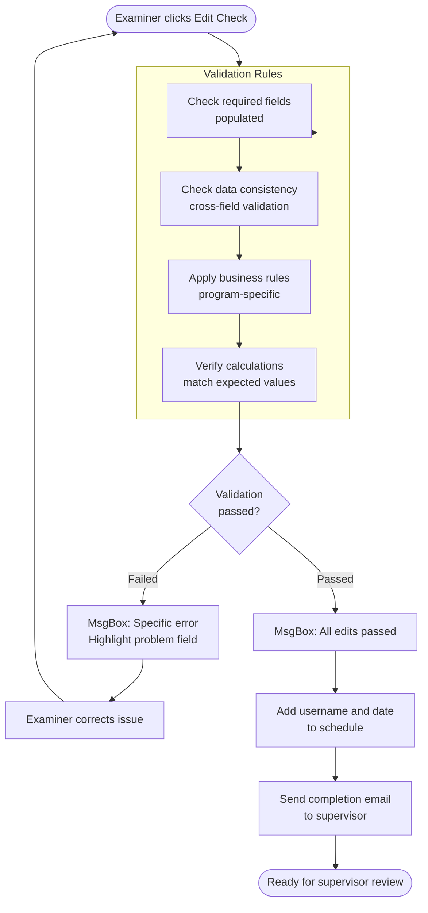

# Edit Checking - Data Validation and Email Workflows

## Overview

Edit checking validates completed schedules before submission to supervisors. It ensures data consistency, required fields are populated, and values meet business rules. After passing validation, automated emails notify supervisors of completion.

## Entry Points

All edit check functions are in `populateMacro/populateMacro/Module3.vba` (1140 lines).

### Program-Specific Edit Checks

| Program | Function | Triggered By |
|---------|----------|--------------|
| SNAP Positive | `snap_edit_check_pos()` | Button on schedule |
| SNAP Negative | `snap_edit_check_neg()` | Button on schedule |
| TANF | `tanf_edit_check()` | Button on schedule |
| GA | `ga_edit_check()` | Button on schedule |
| MA Positive | `ma_edit_check_pos()` | Button on schedule |
| MA Negative | `ma_edit_check_neg()` | Button on schedule |

### Return to Examiner Functions

| Program | Function | Purpose |
|---------|----------|---------|
| SNAP Positive | `snap_return()` | Supervisor returns for corrections |
| SNAP Negative | `snap_neg_return()` | Supervisor returns for corrections |
| TANF | `tanf_return()` | Supervisor returns for corrections |
| MA Positive | `MA_return()` | Supervisor returns for corrections |
| MA Negative | `MA_neg_return()` | Supervisor returns for corrections |

## Validation Flow



## SNAP Positive Edit Check

Location: `Module3.vba` lines 2-110

### Validation Rules

#### 1. ABAWD Status Validation (Section 4)

**Rule:** If person is participating in SNAP and NOT between ages 18-49, ABAWD status must = 9 (exempt)

```vb
If thisws.Range("C22") = 1 Then  ' Valid disposition
    For irow = 89 To 122 Step 3  ' Loop through Section 4
        If thisws.Range("B" & irow) = "" Then Exit For
        
        ' Check: SNAP participant AND not age 18-49 AND ABAWD <> 9
        If Val(thisws.Range("E" & irow)) = 1 And _
           Val(thisws.Range("AH" & irow)) <> 9 And _
           Not (Val(thisws.Range("J" & irow)) > 17 And _
                Val(thisws.Range("J" & irow)) < 50) Then
            
            MsgBox "In Section 4, Person Number " & thisws.Range("B" & irow) & _
                   " is participating in SNAP (Item 47 = 1) " & _
                   "and is not between 18 and 49 years old (Item 49), " & _
                   "but their ABAWD Status (Item 57) is not equal to 9."
            thisws.Range("AH" & irow).Select
            End
        End If
    Next irow
End If
```

**Why:** ABAWD (Able-Bodied Adults Without Dependents) work requirements only apply to ages 18-49.

#### 2. Element Code Required for Errors

**Rule:** If disposition indicates error (Item 8 > 1), must have Element Code (Item 12)

```vb
If thisws.Range("K22") > "1" And thisws.Range("B29") = "" Then
    MsgBox "This is an Error case (Item 8 is not equal to 1), " & _
           "but there is not an Element Code entered in Item 12."
    thisws.Range("B29").Select
    End
End If
```

#### 3. Allotment Adjustment Logic (Item 23-24)

**Rule:** If no adjustment (Item 23 = 1), Item 24 must be blank or dash

```vb
If thisws.Range("AB50") = 1 And _
   Not (thisws.Range("AI50") = "" Or thisws.Range("AI50") = "-") Then
    MsgBox "There is an no adjustment for allotment (Item 23), " & _
           "but there is a dollar amount greater then $0 in Item 24."
    thisws.Range("AB50").Select
    End
End If
```

#### 4. Standard Utility Allowance (Item 44a-44b)

**Rule:** If Item 44a = 1 (using SUA), Item 44b must be blank or dash

```vb
If thisws.Range("W82") = 1 And _
   Not (thisws.Range("AA82") = "" Or thisws.Range("AA82") = "-") Then
    MsgBox "Item 44a is 1, but Item 44b is not blank or a dash."
    thisws.Range("AA82").Select
    End
End If
```

**Rule:** If Item 44a > 1 (not using full SUA), Item 44b must be 1 or 2

```vb
If thisws.Range("W82") > 1 And thisws.Range("AA82") = "" Then
    MsgBox "If item 44a is greater than 1 then item 44b needs to be a 1 or 2."
    End
End If
```

#### 5. LEP (Limited English Proficiency)

**Rule:** Section 7, Line 4, Box 2 cannot be blank

```vb
If thisws.Range("C159") = "" Then
    MsgBox "LEP in Section 7, Line 4, Box 2 is Blank. Please enter a value"
    End
End If
```

#### 6. Earned Income vs Employment Status

**Rule:** If person has earned income in Section 5 (types 11, 12, 14, 16), they cannot have employment status 1 or 2 (not in labor force/unemployed) in Section 4

```vb
For irow = 131 To 143 Step 3  ' Section 5
    If thisws.Range("B" & irow) = "" Then Exit For
    
    For icol = 5 To 32 Step 9  ' Income type columns
        If Val(thisws.Cells(irow, icol)) = 11 Or _
           Val(thisws.Cells(irow, icol)) = 12 Or _
           Val(thisws.Cells(irow, icol)) = 14 Or _
           Val(thisws.Cells(irow, icol)) = 16 Then
            
            found_flag = 0
            For jrow = 89 To 122 Step 3  ' Section 4
                If Val(thisws.Range("B" & jrow)) = Val(thisws.Range("B" & irow)) Then
                    found_flag = 1
                    If Val(thisws.Range("Y" & jrow)) = 1 Or _
                       Val(thisws.Range("Y" & jrow)) = 2 Then
                        MsgBox "Person number " & thisws.Range("B" & jrow) & _
                               " had earned income in Section 5, but is indicated as " & _
                               "not in labor force or unemployed in Section 4."
                        thisws.Range("Y" & jrow).Select
                        End
                    End If
                End If
            Next jrow
            
            If found_flag = 0 Then
                MsgBox "Person number " & thisws.Range("B" & irow) & _
                       " in Section 5 could not be found in Section 4."
                End
            End If
        End If
    Next icol
Next irow
```

### Success Actions

```vb
MsgBox "All edits passed. An email will be sent to your supervisor " & _
       "that this review is completed."

' Add timestamp
Range("AP13") = Environ("USERNAME") & " " & Date
thiswb.Worksheets("FS Workbook").Range("G40") = Date

' Send email to supervisor
Call send_email("SNAP Positive", thisws)
```

## SNAP Negative Edit Check

Location: `Module3.vba` lines 125-154

### Validation Rules

Simpler than positive reviews:

#### 1. Items 19 and 20 Required

**Rule:** If valid case (Item 11 = 1), Items 19 and 20 must be populated

```vb
If thisws.Range("f29") = "1" And _
   (thisws.Range("E52") = "" Or thisws.Range("N52") = "") Then
    MsgBox "Either number 19 and/or 20 have been left blank. Please check."
    thisws.Range("E52").Select
    End
End If
```

### Success Actions

```vb
MsgBox "All edits passed. An email will be sent to your supervisor " & _
       "that this review is completed."

Range("AQ17") = Environ("USERNAME") & " " & Date
Call send_email("SNAP Negative", thisws)
```

## TANF Edit Check

Location: `Module3.vba` lines 210-445

### Validation Rules

Most complex validation logic of all programs.

#### 1. Disposition Code Required

```vb
If thisws.Range("AI10") = "" Then
    MsgBox "Please enter Disposition Code."
    this.Range("AI10").Select
End If
```

#### 2. Relationship and Age Consistency (Section III)

**Rule:** If relationship code is 02, 04, or 15-20, age must be < 20

```vb
For irow = 30 To 48 Step 2
    If thisws.Range("A" & irow) = "" Then Exit For
    
    If (Val(thisws.Range("M" & irow)) >= 20 And _
       (Val(thisws.Range("J" & irow)) = 2 Or _
        Val(thisws.Range("J" & irow)) = 4 Or _
       (Val(thisws.Range("J" & irow)) < 21 And _
        Val(thisws.Range("J" & irow)) > 14))) Then
        
        MsgBox "In Section III, Person Number " & thisws.Range("A" & irow) & _
               " has a Relationship to Payment Name Code of 02, 04, or 15 to 20, " & _
               "but their age is greater than or equal to 20 years old."
        thisws.Range("G" & irow).Select
        End
    End If
Next irow
```

**Codes:**
- 02 = Minor child
- 04 = Minor spouse
- 15-20 = Various minor dependent relationships

#### 3. Case Member Count Validation

**Rule:** Count of Dep./Rel. codes 21-38 or 63 must equal Number of Case Members

```vb
count_members = 0
For irow = 30 To 44 Step 2
    If thisws.Range("A" & irow) = "" Then Exit For
    
    If (Val(thisws.Range("G" & irow)) > 20 And _
        Val(thisws.Range("G" & irow)) < 39) Or _
        Val(thisws.Range("G" & irow)) = 63 Then
        count_members = count_members + 1
    End If
Next irow

If count_members <> Val(thisws.Range("W16")) Then
    MsgBox "Count of Persons in Section III with Dep./Rel. between 21 and 38 or 63 " & _
           "equals " & count_members & " which does not equal Number of Case Members " & _
           "in Section II which is " & Val(thisws.Range("W16"))
    thisws.Range("G30").Select
    End
End If
```

#### 4. Sample Month Payment Match (Section V)

**Rule:** Income type 47 amount must equal Sample Month Payment

```vb
For irow = 50 To 56 Step 2
    If thisws.Range("C" & irow) = "" Then Exit For
    
    For icol = 7 To 37 Step 10
        If Val(thisws.Cells(irow, icol)) = 47 Then
            If Val(thisws.Cells(irow, icol + 4)) <> Val(thisws.Range("I20")) Then
                MsgBox "In Section V, Amount of income with Income Type 47 ($" & _
                       Val(thisws.Cells(irow, icol + 4)) & ") does not equal " & _
                       "Sample Month Payment ($" & Val(thisws.Range("I20")) & ")."
                thisws.Cells(irow, icol + 5).Select
                End
            End If
        End If
    Next icol
Next irow
```

#### 5. Work Activity Validation

**Rule:** If income type 11 (earned income) > 0, Work Activity must be 00-04

```vb
For irow = 50 To 56 Step 2
    If thisws.Range("C" & irow) = "" Then Exit For
    
    For icol = 7 To 37 Step 10
        If Val(thisws.Cells(irow, icol)) = 11 And _
           Val(thisws.Cells(irow, icol + 4)) > 0 Then
            
            For irowiii = 30 To 44 Step 2
                If Val(thisws.Range("C" & irow)) = Val(thisws.Range("A" & irowiii)) Then
                    If Val(thisws.Range("AC" & irowiii)) > 4 Then
                        MsgBox "In Section V, Person Number " & thisws.Range("C" & irow) & _
                               " has Income Type 11, but Work Activity " & _
                               thisws.Range("AC" & irowiii) & _
                               ". Work Activity should be 00 - 04 for Income Type 11."
                        thisws.Range("AC" & irowiii).Select
                        End
                    End If
                End If
            Next irowiii
        End If
    Next icol
Next irow
```

#### 6. Person Number Consistency

**Rule:** All person numbers in Sections IV (income) and V must exist in Section III (household)

```vb
For irow = 50 To 56 Step 2
    If thisws.Range("C" & irow) = "" Then Exit For
    
    found = 0
    For jrow = 30 To 44 Step 2
        If thisws.Range("C" & irow) = thisws.Range("A" & jrow) Then
            found = 1
        End If
    Next jrow
    
    If found = 0 Then
        thisws.Range("C" & irow).Select
        MsgBox "No match for person number " & thisws.Range("C" & irow) & _
               " in Section IV was found in Section III."
        End
    End If
Next irow
```

#### 7. Amount of Error vs Review Findings

**Rule:** If Amount of Error > 0, Review Findings must be 2, 3, or 4 (not 1/Clean)

```vb
If thisws.Range("AO10") > 0 And Val(thisws.Range("AL10")) < 2 Then
    MsgBox "Review Findings is " & thisws.Range("AL10") & _
           " and Amount of Error is " & thisws.Range("AO10") & _
           ". However, if Amount of Error greater than 0, " & _
           "then Review Findings must be 2, 3, or 4."
    End
End If
```

#### 8. Required Fields for Disposition = 1

**Rule:** If valid case, certain fields cannot be blank

```vb
If thisws.Range("AI10") = 1 Then
    If thisws.Range("AB20") = "" Or thisws.Range("AH20") = "" Or _
       thisws.Range("AN20") = "" Or thisws.Range("B24") = "" Or _
       thisws.Range("U24") = "" Or thisws.Range("AN24") = "" Then
        MsgBox "Gross Countable Income, Income Disregard, Net Countable Income, " & _
               "Food Stamp Allotment, Overpayment Recoupment and TANF Days " & _
               "cannot be blank if Disposition = 1."
        End
    End If
End If
```

#### 9. Date Logic

**Rule:** Most Recent Action >= Most Recent Opening

```vb
If thisws.Range("L16") < thisws.Range("A16") Then
    MsgBox "Most recent action date (" & Format(thisws.Range("L16"), "mm/dd/yyyy") & _
           ") must be greater than or equal to the most recent opening date (" & _
           Format(thisws.Range("A16"), "mm/dd/yyyy") & ")."
    End
End If
```

**Rule:** Both dates must be <= review month end date

```vb
reviewmonthend = DateSerial(Val(Right(thisws.Range("AB10"), 4)), _
                            Val(Left(thisws.Range("AB10"), 2)) + 1, 0)

If thisws.Range("A16") > reviewmonthend Then
    MsgBox "Most Recent Opening date (" & Format(thisws.Range("A16"), "mm/dd/yyyy") & _
           ") is after the end of the review month (" & _
           Format(reviewmonthend, "mm/dd/yyyy") & ")."
    End
End If
```

#### 10. Education Level Validation

**Rule:** If Disposition = 1, Education Level must be 01-19, 98, or 99 (not 00)

```vb
If thisws.Range("AI10") = 1 And Val(thisws.Range("V" & irow)) = 0 Then
    MsgBox "Education Level must be 01 - 19, 98 and 99, if Disposition = 1."
    End
End If
```

## GA Edit Check

Location: `Module3.vba` lines 169-209

Similar to TANF but simpler:

```vb
' Disposition code required
If thisws.Range("AI10") = "" Then
    MsgBox "Please enter Disposition Code."
    this.Range("AI10").Select
End If

' Error amount vs findings
If thisws.Range("AO10") > 0 And Val(thisws.Range("AL10")) < 2 Then
    MsgBox "Review Findings is " & thisws.Range("AL10") & _
           " and Amount of Error is " & thisws.Range("AO10") & _
           ". However, if Amount of Error greater than 0, " & _
           "then Review Findings must be 2, 3, or 4."
    End
End If

' Date logic
If thisws.Range("L16") < thisws.Range("A16") Then
    MsgBox "Most recent action date must be greater than or equal to " & _
           "the most recent opening date."
    End
End If
```

## MA Positive Edit Check

Location: `Module3.vba` lines 461-562

### Validation Rules

#### 1. Person Number Formatting

**Rule:** Single-digit person numbers converted to double-digit (01-09)

```vb
For irow = 51 To 73 Step 2  ' Section III
    If Len(thisws.Range("B" & irow)) = 1 Then
        thisws.Range("B" & irow) = "0" & thisws.Range("B" & irow)
    End If
Next irow

For irow = 78 To 84 Step 2  ' Section IV
    If Len(thisws.Range("B" & irow)) = 1 Then
        thisws.Range("B" & irow) = "0" & thisws.Range("B" & irow)
    End If
Next irow
```

#### 2. COVID Code Required

```vb
If thisws.Range("AK10") = "" And thisws.Range("F16") = 1 Then
    MsgBox "Please enter a COVID Code."
    thisws.Range("AK10").Select
    End
End If
```

#### 3. Prior Assistance and Action Codes

```vb
If thisws.Range("J27") = "" And thisws.Range("F16") = 1 Then
    MsgBox "Please enter a Prior Assistance Code."
    thisws.Range("J27").Select
    End
End If

If thisws.Range("V27") = "" And thisws.Range("F16") = 1 Then
    MsgBox "Please enter an Action Code."
    thisws.Range("V27").Select
    End
End If
```

#### 4. Section III/IV Person Match

**Rule:** All persons in Section IV (income) must exist in Section III (household)

```vb
For irow = 78 To 84 Step 2
    If thisws.Range("B" & irow) = "" Then Exit For
    
    found = 0
    For jrow = 51 To 73 Step 2
        If thisws.Range("B" & irow) = thisws.Range("B" & jrow) Then
            found = 1
        End If
    Next jrow
    
    If found = 0 Then
        thisws.Range("B" & irow).Select
        MsgBox "No match for person number " & thisws.Range("B" & irow) & _
               " in Section IV was found in Section III."
        End
    End If
Next irow
```

#### 5. Gross Countable Income Calculation

**Rule:** Sum of all incomes in Section IV must equal Gross Countable Income

```vb
sum_income = 0
For irow = 78 To 84 Step 2
    For icol = 10 To 40 Step 10
        sum_income = sum_income + thisws.Cells(irow, icol)
    Next icol
Next irow

If sum_income <> thisws.Range("AF32") Then
    thisws.Range("B78").Select
    MsgBox "Sum of incomes ($" & sum_income & _
           ") in section IV did not match Gross Countable Income ($" & _
           thisws.Range("AF32") & ")."
    End
End If
```

#### 6. Age and Employment Status

**Rule:** If age < 16, employment status should be dash (-)

```vb
For irow = 51 To 73 Step 2
    If thisws.Range("R" & irow) < 16 And thisws.Range("R" & irow) <> "" Then
        thisws.Range("AM" & irow) = "-"
    End If
Next irow
```

#### 7. Section V Date Validation

**Rule:** Error finding dates cannot be later than sample month

```vb
For irow = 96 To 112 Step 2
    If thisws.Range("AL" & irow) = "" Then Exit For
    
    sample_date = DateSerial(Right(thisws.Range("AM10"), 4), _
                             Left(thisws.Range("AM10"), 2), 1)
    
    If thisws.Range("AL" & irow) > sample_date Then
        thisws.Range("AL" & irow).Select
        MsgBox "One of the dates " & thisws.Range("AL" & irow) & _
               " in Section V is later than the Sample Month."
        End
    End If
Next irow
```

## MA Negative Edit Check

Location: `Module3.vba` lines 887-914

Simplest validation - mostly automatic:

```vb
' If drop case, clear required fields
If thisws.Range("M56") <> 0 Then
    thisws.Range("J19") = ""
    thisws.Range("S19") = ""
    thisws.Range("C25") = ""
    thisws.Range("Q25") = ""
    thisws.Range("C40") = ""
End If

' Always clear box J
thisws.Range("C56") = ""

' Success
MsgBox "All edits passed. An email will be sent to your supervisor " & _
       "that this review is completed."
Call send_email("MA Negative", thisws)
Range("AI9") = Environ("USERNAME") & " " & Date
Range("L11") = Date
```

## Email Notification System

### Send Email (Completion)

Location: `Module3.vba` lines 578-764

```vb
Sub send_email(review_type As String, thisws As Worksheet)
```

**Process:**

1. **Locate Finding Memo Data Source**
```vb
PathStr = DLetter & "Finding Memo\"
SrceFile = PathStr & "Finding Memo Data Source.xlsx"
DestFile = sPath & "\FM DS Temp.xlsx"
FileCopy SrceFile, DestFile
Workbooks.Open fileName:=DestFile, UpdateLinks:=False
```

2. **Extract Review Information**
```vb
Select Case review_type
    Case "SNAP Positive"
        review_number = thisws.Range("A18")
        sample_month = thisws.Range("AD18") & thisws.Range("AG18")
        datasourcews.Range("A7") = Val(thisws.Range("AJ5") & thisws.Range("AK5"))
        
        If Val(thisws.Range("C22")) = 1 Then
            If Val(thisws.Range("K22")) = 1 Then
                finding_code = " clean."
            Else
                finding_code = " in error."
            End If
        Else
            finding_code = " a drop."
        End If
End Select
```

3. **Look Up Supervisor Email**
```vb
' Data source contains examiner number in A7
' Returns supervisor email in AO4
.To = datasourcews.Range("AO4")
```

4. **Compose Email**
```vb
With OutMail
    .To = datasourcews.Range("AO4")
    .Subject = "Completion of " & review_type & " Schedule Review " & _
               review_number & " Month " & sample_month & " Examiner " & _
               datasourcews.Range("A7")
    
    .HTMLBody = "Hi " & datasourcews.Range("AP2") & ", " & "<br><br>" & _
                datasourcews.Range("AM2") & " has completed the " & review_type & _
                " Schedule Review " & review_number & " for Sample Month " & _
                sample_month & ". This case is" & finding_code
    
    .NoAging = True
    .Display
End With

SendKeys "%{s}", True  ' Auto-send
```

### Send Email Edit (Return to Examiner)

Location: `Module3.vba` lines 765-885

```vb
Sub send_email_edit(review_type As String, thisws As Worksheet)
```

**Differences:**

1. **Recipient:** Examiner instead of supervisor
```vb
.To = datasourcews.Range("AM4")  ' Examiner email
'.CC = datasourcews.Range("AP2")  ' Optional: CC supervisor
```

2. **Subject:** Indicates return
```vb
.Subject = "Return to Examiner " & review_type & " Schedule Review " & _
           review_number & " Month " & sample_month & " Examiner " & _
           datasourcews.Range("A7")
```

3. **Body:** Prompts supervisor for reason
```vb
.HTMLBody = "Hi " & datasourcews.Range("AM2") & ", " & "<br><br>" & _
            datasourcews.Range("AP2") & " found the following error in your review " & _
            InputBox("Why are you returning review to examiner?") & _
            " for review number " & review_number & " for Sample Month " & _
            sample_month & "."
```

4. **Auto-send:** Slower to allow supervisor to edit
```vb
SendKeys "%{s}", False  ' Slower send
```

## Optimization: V2 vs V1

### Current (V1) Implementation

**Characteristics:**
- Cell-by-cell validation
- Sequential processing
- No database integration
- Email per review

**Performance:**
- ~1-2 seconds per review
- Manual supervisor notification

### V2 Optimized Implementation

See `editCheckingMacros/WhatChanged.md` for complete details.

**Key Improvements:**

1. **Batch Reading**
```vb
' V1: Cell-by-cell
If thisws.Range("C22") = 1 Then ...

' V2: Array-based
srcCache = thisws.Range("A1:AP150").Value
If srcCache(22, 3) = 1 Then ...
```

2. **Pre-calculated Lookups**
```vb
' V2: Build lookup tables once
For i = 2 To maxrow
    examLookup(vInput(i, 3)) = vInput(i, 1)  ' Number -> Name
Next i
```

3. **Database Transfer with Transactions**
```vb
' V2: Recordset with transaction
cnt.BeginTrans
For r = 1 To rowCount
    rs.AddNew
    For c = 1 To colCount
        rs.Fields(FieldMap(c)).Value = dataArr(r, c)
    Next c
    rs.Update
Next r
cnt.CommitTrans
```

**Performance Gains:**
- 10-50x faster for batch processing
- Single database write instead of many
- Can process 100+ reviews in minutes vs hours

**Status:** V2 code exists but not yet deployed to production

## Common Validation Patterns

### Pattern 1: Required Field

```vb
If thisws.Range("XX##") = "" Then
    MsgBox "Please enter [Field Name]."
    thisws.Range("XX##").Select
    End
End If
```

### Pattern 2: Conditional Requirement

```vb
If condition_met And thisws.Range("XX##") = "" Then
    MsgBox "[Field Name] is required when [condition]."
    thisws.Range("XX##").Select
    End
End If
```

### Pattern 3: Cross-Field Consistency

```vb
If thisws.Range("XX##") <> expected_value Then
    MsgBox "[Field 1] value " & thisws.Range("XX##") & _
           " does not match [Field 2] value " & expected_value
    thisws.Range("XX##").Select
    End
End If
```

### Pattern 4: Date Comparison

```vb
If thisws.Range("Date1") < thisws.Range("Date2") Then
    MsgBox "Date 1 must be >= Date 2."
    End
End If
```

### Pattern 5: Lookup Validation

```vb
found = 0
For each_row
    If match_found Then found = 1
Next
If found = 0 Then
    MsgBox "Value not found in lookup table."
    End
End If
```

## Best Practices for Reviewers

### Before Running Edit Check

1. ✅ Complete all required fields for your program
2. ✅ Review calculated fields match expectations
3. ✅ Verify person numbers consistent across sections
4. ✅ Check dates are logical and within sample month
5. ✅ Save workbook before edit check

### When Edit Check Fails

1. 📖 Read error message carefully
2. 🎯 Note which cell is selected (problem location)
3. 🔍 Check related fields mentioned in error
4. ✏️ Correct the issue
5. 🔄 Run edit check again

### After Passing Edit Check

1. ✅ Email sent automatically to supervisor
2. ✅ Timestamp recorded on schedule
3. ✅ Wait for supervisor approval
4. ❌ Do NOT make further edits (will require re-validation)

---

**Next:** [UserForms and Memos](05-userforms-and-memos.md) - Form selection and document generation

