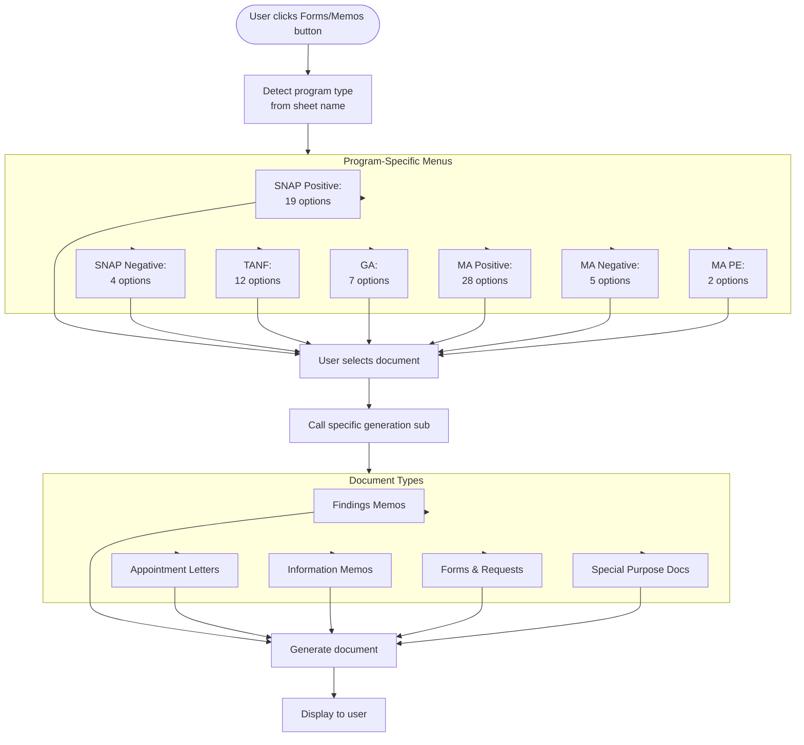
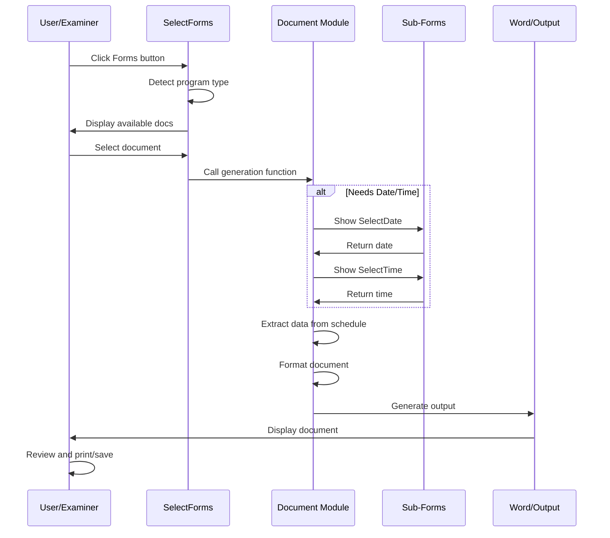

# UserForms and Memos - Document Generation

## Overview

The system includes numerous UserForms for generating memos, letters, and forms needed during the QC review process. The `SelectForms` UserForm acts as the main menu, presenting program-specific options to the user.

## Entry Point

Location: `populateMacro/populateMacro/SelectForms.frm` (365 lines)

### How It's Triggered

```vb
' From schedule worksheet buttons or Module code
SelectForms.Show
```

When displayed, the form presents a ListBox of available documents based on the active worksheet's program type.

## SelectForms UserForm Architecture



## Program Detection Logic

```vb
Private Sub UserForm_Initialize()
    Select Case Left(ActiveSheet.Name, 1)
        Case "5"  ' SNAP Positive/Supplemental (50xxx, 51xxx, 55xxx)
            ' Add SNAP Positive options
        Case "6"  ' SNAP Negative (60xxx, 61xxx, 65xxx, 66xxx)
            ' Add SNAP Negative options
        Case "1"  ' TANF (14xxx)
            ' Add TANF options
        Case "9"  ' GA (9xxxx)
            ' Add GA options
        Case "2"  ' MA Positive (20xxx, 21xxx) or PE (24xxx)
            If Left(ActiveSheet.Name, 2) = "24" Then
                ' Add MA PE options
            Else
                ' Add MA Positive options
            End If
        Case "8"  ' MA Negative (80xxx, 81xxx, 82xxx, 83xxx)
            ' Add MA Negative options
    End Select
End Sub
```

## Available Documents by Program

### SNAP Positive (19 Documents)

```vb
ListBox1.AddItem ("Findings Memo")                         ' Index 0
ListBox1.AddItem ("CAO Appointment Letter")               ' Index 1
ListBox1.AddItem ("Case Summary Template")                ' Index 2
ListBox1.AddItem ("Telephone Appointment Letter")         ' Index 3
ListBox1.AddItem ("SNAP QC14F Memo")                      ' Index 4
ListBox1.AddItem ("SNAP QC14R Memo")                      ' Index 5
ListBox1.AddItem ("SNAP QC14C Memo")                      ' Index 6
ListBox1.AddItem ("Timeliness Information/Finding Memo")  ' Index 7
ListBox1.AddItem ("Information Memo")                     ' Index 8
ListBox1.AddItem ("Post Office Memo")                     ' Index 9
ListBox1.AddItem ("Pending Letter")                       ' Index 10
ListBox1.AddItem ("Drop Worksheet")                       ' Index 11
ListBox1.AddItem ("CAO Forms Request")                    ' Index 12
ListBox1.AddItem ("Error Under Threshold Memo")           ' Index 13
ListBox1.AddItem ("LEP")                                  ' Index 14
ListBox1.AddItem ("Spanish CAO Appointment Letter")       ' Index 15
ListBox1.AddItem ("Spanish Telephone Appointment Letter") ' Index 16
ListBox1.AddItem ("PA78")                                 ' Index 17
ListBox1.AddItem ("Spanish Pending Letter")               ' Index 18
```

**Document Routing:**
```vb
If i = 0 Then
    Call Finding_Memo_sub
ElseIf i = 1 Then
    Call CAOAppt
ElseIf i = 2 Then
    Call Rush
ElseIf i = 3 Then
    Call TeleAppt
ElseIf i = 4 Then
    Call QC14F
' ... etc
```

### SNAP Negative (4 Documents)

```vb
ListBox1.AddItem ("Findings Memo")          ' Index 0
ListBox1.AddItem ("Case Summary Template")  ' Index 1
ListBox1.AddItem ("Negative Info Memo")     ' Index 2
ListBox1.AddItem ("LEP")                    ' Index 3
```

**Simplified Menu:** Negative reviews require fewer documents than positive.

### TANF (12 Documents)

```vb
ListBox1.AddItem ("Findings Memo")                          ' Index 0
ListBox1.AddItem ("Information Memo")                       ' Index 1
ListBox1.AddItem ("Potential Error Call Memo")              ' Index 2
ListBox1.AddItem ("Notification Requirement Info Memo")     ' Index 3
ListBox1.AddItem ("AMR")                                    ' Index 4
ListBox1.AddItem ("Criminal History")                       ' Index 5
ListBox1.AddItem ("TANF CAO Request Form")                  ' Index 6
ListBox1.AddItem ("SAVE")                                   ' Index 7
ListBox1.AddItem ("Employment/Earnings Report")             ' Index 8
ListBox1.AddItem ("LEP")                                    ' Index 9
ListBox1.AddItem ("TANF Pending")                           ' Index 10
ListBox1.AddItem ("School Verification")                    ' Index 11
```

**TANF-Specific:**
- AMR (Application and Maintenance Report)
- Criminal History verification
- School Verification (for minors)

### GA (7 Documents)

```vb
ListBox1.AddItem ("Findings Memo")               ' Index 0
ListBox1.AddItem ("AMR Memo")                    ' Index 1
ListBox1.AddItem ("Criminal History Memo")       ' Index 2
ListBox1.AddItem ("Information Memo")            ' Index 3
ListBox1.AddItem ("Potential Error Call Memo")   ' Index 4
ListBox1.AddItem ("SAVE")                        ' Index 5
ListBox1.AddItem ("Employment/Earnings Report")  ' Index 6
```

**Similar to TANF:** GA (General Assistance) uses similar document set to TANF as both are cash assistance programs.

### MA Positive (28 Documents)

Most extensive menu:

```vb
ListBox1.AddItem ("Findings Memo")                   ' Index 0
ListBox1.AddItem ("Deficiency Memo")                 ' Index 1
ListBox1.AddItem ("MA Appointment Letter")           ' Index 2
ListBox1.AddItem ("Community Spouse Questionaire")   ' Index 3
ListBox1.AddItem ("Potential Error Call Memo")       ' Index 4
ListBox1.AddItem ("Information Memo")                ' Index 5
ListBox1.AddItem ("QC14 Coop Memo")                  ' Index 6
ListBox1.AddItem ("QC14 CAO Request Memo")           ' Index 7
ListBox1.AddItem ("QC15 Memo")                       ' Index 8
ListBox1.AddItem ("Preliminary Information Memo")    ' Index 9
ListBox1.AddItem ("NH LRR")                          ' Index 10
ListBox1.AddItem ("NH Home Business")                ' Index 11
ListBox1.AddItem ("PA472-Pending Letter")            ' Index 12
ListBox1.AddItem ("PA472-Self Emp.")                 ' Index 13
ListBox1.AddItem ("Self Emp.")                       ' Index 14
ListBox1.AddItem ("PA76")                            ' Index 15
ListBox1.AddItem ("PA78")                            ' Index 16
ListBox1.AddItem ("PA83-Z")                          ' Index 17
ListBox1.AddItem ("Household Composition")           ' Index 18
ListBox1.AddItem ("SAVE Deficiency Memo")            ' Index 19
ListBox1.AddItem ("MA Support Form")                 ' Index 20
ListBox1.AddItem ("MA Waiver Memo")                  ' Index 21
ListBox1.AddItem ("Adoption Foster Care")            ' Index 22
ListBox1.AddItem ("Zero Income Request")             ' Index 23
ListBox1.AddItem ("QC14 LTC Waiver Memo")            ' Index 24
ListBox1.AddItem ("Funeral Home Letter")             ' Index 25
ListBox1.AddItem ("LEP")                             ' Index 26
ListBox1.AddItem ("Spanish MA App. Letter")          ' Index 27
```

**MA-Specific:**
- Community Spouse Questionnaire (for long-term care cases)
- NH LRR (Nursing Home Legal Responsible Relative)
- NH Home Business (Nursing Home home business verification)
- PA472-xxx (Various Pennsylvania forms)
- LTC Waiver (Long-Term Care)
- Funeral Home Letter (for burial assistance cases)

### MA Negative (5 Documents)

```vb
ListBox1.AddItem ("Findings Memo")               ' Index 0
ListBox1.AddItem ("Deficiency Memo")             ' Index 1
ListBox1.AddItem ("Potential Error Call Memo")   ' Index 2
ListBox1.AddItem ("Information Memo")            ' Index 3
ListBox1.AddItem ("LEP")                         ' Index 4
```

### MA PE (2 Documents)

Presumptive Eligibility reviews have minimal document needs:

```vb
ListBox1.AddItem ("Findings Memo")      ' Index 0
ListBox1.AddItem ("Information Memo")   ' Index 1
```

## Common Document Types

### 1. Findings Memo

**Purpose:** Documents errors found during QC review

**Generation Function:** `Finding_Memo_sub()` or `MA_Finding_Memo_sub(memo_type)`

**Key Features:**
- Pulls data from active schedule
- Lists all error findings with element codes
- Calculates error amounts
- Formats for official use

**Parameters (MA only):**
- `"MA_Neg_Find"` - MA Negative Findings
- `"MA_Neg_Def"` - MA Negative Deficiency
- `"MA_Pos_Find"` - MA Positive Findings
- `"MA_Pos_Def"` - MA Positive Deficiency
- `"MA_PE_Find"` - MA PE Findings
- `"MA_Pos_SAVE"` - MA Positive SAVE deficiency

### 2. Information Memo

**Purpose:** Provides information without indicating error

**Function:** `Info()`

**Use Cases:**
- Questions for CAO
- Clarification needed
- Information sharing

### 3. Appointment Letters

**CAO Appointment:** `CAOAppt()`, `MAAppt()`, `SpCAOAppt()` (Spanish), `MASpCAOAppt()` (MA Spanish)

**Telephone Appointment:** `TeleAppt()`, `SpTeleAppt()` (Spanish)

**Content:**
- Date and time selection via UserForms
- Office location
- Items to bring
- QC contact information

### 4. QC14 Series Memos

**QC14F:** `QC14F()` - Findings requiring CAO cooperation
**QC14R:** `QC14R()` - Request for cooperation
**QC14C:** `QC14C()` - Cooperation memo
**QC14:** `QC14()` - Standard QC14

**Purpose:** Formal communication with County Assistance Offices

### 5. Special Forms

**LEP:** `LEP()` - Limited English Proficiency documentation

**AMR:** `AMR()` - Application and Maintenance Report (TANF/GA)

**SAVE:** `TANF_SAVE()` - Systematic Alien Verification for Entitlements

**Criminal History:** `Criminal()` - Criminal background verification

## Date and Time Selection UserForms

### SelectDate UserForm

```vb
' User selects date from calendar control or date picker
' Returns date in format mm/dd/yyyy
```

**Used By:**
- Appointment letters
- Pending letters
- Any document requiring date input

**Features:**
- Calendar visual interface
- Date validation
- Current date default

### SelectTime UserForm

```vb
' User selects time from dropdowns
' Hour (1-12), Minute (00-59), AM/PM
' Returns time in format HH:MM AM/PM
```

**Used By:**
- Appointment letters
- Phone call scheduling

**Features:**
- 12-hour format
- 15-minute interval suggestions
- Validation of valid times

## Program-Specific Helper Forms

### UserForm1 (TANF)

**Purpose:** "Where do Results Go?" - TANF computation helper

```vb
Private Sub CommandButton1_Click()
    If UserForm1.ComboBox1.Value = "" Then
        MsgBox "Please pick a column to place your results."
        UserForm1.Hide
        redisplayform1
    End If
    
    Worksheets("TANF Computation").Range("AL77") = UserForm1.ComboBox1.Value
    UserForm1.Hide
    TANFfinalresults
End Sub
```

**Function:** Directs where computation results are placed in TANF worksheet

### UserForm2 (TANF)

Similar helper for TANF-specific computations.

### GAUserForm1 & GAUserForm2

**Purpose:** GA (General Assistance) computation helpers

**Similar to:** TANF UserForms but for GA-specific calculations

### MASelectForms

**Purpose:** MA-specific form selection (alternative to SelectForms for MA programs)

**Features:**
- MA-specific layout
- Streamlined MA options
- Integration with MA_Comp_mod

### UserFormMAC2 & UserFormMAC3

**Purpose:** MA computation helpers

**UserFormMAC2:** Primary MA calculation interface
**UserFormMAC3:** Secondary MA calculation interface

## Document Generation Modules

### Finding_Memo.vba

Large module (~3000+ lines) handling findings memo generation.

**Key Functions:**
- Data extraction from schedules
- Error element formatting
- Amount calculations
- Word document generation (or PDF export)

### CashMemos.vba

Contains templates and generation logic for cash assistance memos:
- TANF-specific memos
- GA-specific memos
- Information memos
- Deficiency memos

### CAO_Appointment.vba

Handles appointment letter generation:

```vb
Sub CAOAppt()
    ' Display date selection form
    SelectDate.Show
    ' Get selected date
    appt_date = SelectDate.selected_date
    
    ' Display time selection form
    SelectTime.Show
    appt_time = SelectTime.selected_time
    
    ' Generate letter with date/time
    ' Insert into Word or Excel template
    ' Display for user
End Sub
```

## Drop Worksheet Module

Location: `populateMacro/populateMacro/Drop.vba` (108 lines)

**Purpose:** Clear schedule data for drop cases

**Confirmation Required:**
```vb
Answer = MsgBox("This will delete values on your schedule. " & _
                "Are you sure you want to delete them?", _
                vbQuestion + vbYesNo, "???")

If Answer = vbNo Then Exit Sub
```

**What Gets Cleared (by Program):**

**SNAP Positive:**
```vb
Range("K22:O22") = ""   ' Finding codes
Range("Y22:O22") = ""   ' Additional codes
Range("A131:AN143") = "" ' Section 5 - Income

' Section 2 - Household members
For i = 29 To 43 Step 2
    Range("B" & i & ":AN" & i) = ""
Next
```

**TANF:**
```vb
Range("A16:Y16") = ""    ' Section II
Range("C20:AN20") = ""   ' Sample month payment
Range("B24:AN24") = ""   ' Calculations

' Section III - Household
For i = 30 To 44 Step 2
    Range("A" & i & ":AQ" & i) = ""
Next

' Section IV & V - Income
For i = 50 To 56 Step 2
    Range("C" & i & ":AO" & i) = ""
Next
```

**MA Positive:**
```vb
Range("A27:AN27") = ""  ' Section II
Range("B32:AN32") = ""  ' Calculations

' Section III - Household
For i = 51 To 73 Step 2
    Range("B" & i & ":AQ" & i) = ""
Next

' Section IV - Income
For j = 78 To 84 Step 2
    Range("B" & i & ":AN" & i) = ""
Next

' Section V - Error findings
For k = 96 To 112 Step 2
    Range("B" & i & ":AQ" & i) = ""
Next
```

## Document Generation Workflow



## Template Locations

Documents are typically generated from templates stored in:

```
{DLetter}\DQC\Finding Memo\
{DLetter}\DQC\Templates\
```

Templates may be:
- Word documents (`.docx`)
- Excel workbooks (`.xlsx`)
- Text files (`.txt`)

## Best Practices

### For Examiners

1. ✅ **Complete schedule first** - Most memos pull data from schedule
2. ✅ **Save before generating** - Ensures latest data is used
3. ✅ **Review generated document** - Verify all fields populated correctly
4. ✅ **Edit before finalizing** - Templates are starting points
5. ✅ **Print to PDF** - Create permanent record

### For Supervisors

1. ✅ **Standardize templates** - Ensure consistency across examiners
2. ✅ **Test after updates** - Verify forms work after template changes
3. ✅ **Document customizations** - Note any program-specific requirements
4. ✅ **Train on new forms** - Orient staff when adding new documents

### Common Issues

**Problem:** Date picker doesn't appear
**Solution:** Check UserForm is included in workbook modules

**Problem:** Generated document has blank fields
**Solution:** Verify schedule has data in expected cells

**Problem:** Wrong form list appears
**Solution:** Ensure worksheet name matches program convention

**Problem:** Spanish letters not generating
**Solution:** Check for Spanish template files in template folder

## Language Support

Several documents have Spanish versions:

- **Spanish CAO Appointment Letter** - `SpCAOAppt()`
- **Spanish Telephone Appointment** - `SpTeleAppt()`
- **Spanish Pending Letter** - `SNAPPend()` (Spanish variant)
- **Spanish MA Appointment Letter** - `MASpCAOAppt()`

**Implementation:** Separate functions with Spanish text hard-coded or using Spanish templates.

## Future Enhancements

**Potential Improvements:**
1. Consolidate duplicate code between Spanish/English versions
2. Use external language files for easier translation
3. Add document preview before final generation
4. Include document history tracking
5. Auto-save generated documents to case folder
6. Email integration to send documents directly

---

**Next:** [Approval Workflow](06-approval-workflow.md) - Supervisor and clerical approval process

