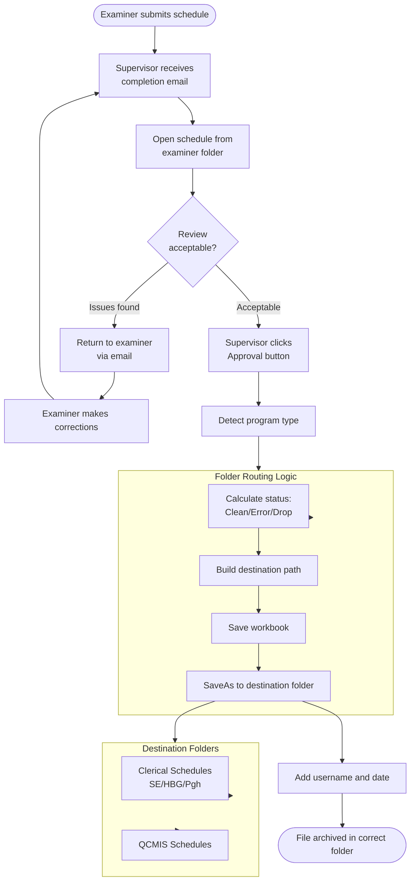

# Approval Workflow - Supervisor and Clerical Processing

## Overview

After examiners complete schedules and pass edit checks, supervisors review and approve the work. The approval process includes timestamping, validation, folder routing, and email notifications.

## Entry Points

All approval functions are in `populateMacro/populateMacro/Module1.vba` (1213 lines).

### Main Approval Functions

| Function | Purpose | Triggered By |
|----------|---------|--------------|
| `UserNameWindows()` | Supervisor approval with file routing | Button on schedule |
| `ClericalApproval()` | Secondary clerical approval | Button on schedule |
| `SuprWorkbook()` | Approve workbook sheet only | Button on workbook |
| `tracking_supr()` | Add supervisor tracking | Button |

## Approval Flow



## Supervisor Approval (`UserNameWindows`)

Location: `Module1.vba` lines 5-257

### Program Detection

```vb
Select Case Left(ActiveSheet.Name, 1)
    Case "1"  ' TANF (14xxx)
        ' TANF approval logic
    Case "9"  ' GA (9xxxx)
        ' GA approval logic
    Case "2"  ' MA Positive (20xxx, 21xxx, 24xxx)
        ' MA Positive approval logic
    Case "5"  ' SNAP Positive (50xxx, 51xxx, 55xxx)
        ' SNAP Positive approval logic
    Case "8"  ' MA Negative (80xxx, 81xxx, 82xxx, 83xxx)
        ' MA Negative approval logic
    Case "6"  ' SNAP Negative (60xxx, 61xxx, 65xxx, 66xxx)
        ' SNAP Negative approval logic
End Select
```

## Status Determination (Clean/Error/Drop)

### TANF & GA Status Logic

```vb
foldertxt = ""
If Range("AI10") > 1 Then
    foldertxt = "Drop"      ' Disposition not valid
ElseIf Range("AL10") = 1 Then
    foldertxt = "Clean"     ' No errors found
Else
    foldertxt = "Error"     ' Errors present
End If
```

**Status Codes:**
- **Drop:** Disposition > 1 (invalid case, unable to complete)
- **Clean:** Review Findings = 1 (no errors)
- **Error:** Review Findings = 2, 3, or 4 (errors found)

### SNAP Positive Status Logic

```vb
foldertxt = ""
If Range("C22") > 1 Then
    foldertxt = "Drop"      ' Disposition not valid
ElseIf Range("K22") = 1 Then
    foldertxt = "Clean"     ' Clean case
Else
    foldertxt = "Error"     ' Error case
End If
```

### MA Positive Status Logic

```vb
foldertxt = ""
If Range("F16") <> 1 Then
    foldertxt = "Drop"              ' Initial eligibility not valid
ElseIf Range("F16") = 1 And Val(Range("S16")) = 1 Then
    foldertxt = "Clean"             ' Valid and clean
Else
    foldertxt = "Error"             ' Valid but error
End If
```

### MA Negative Status Logic

More complex than other programs:

```vb
foldertxt = ""
If Range("M56") <> 0 Then
    foldertxt = "Drop"              ' Disposition = drop
ElseIf (Range("C25") > 1 And Range("C25") < 5) Or _
       Range("C40") = 2 Or _
       ((Range("C40") > 2 And Range("C40") < 6) And Range("C56") = 2) Then
    foldertxt = "Error"             ' Complex error conditions
Else
    foldertxt = "Clean"             ' Clean case
End If
```

### SNAP Negative Status Logic

```vb
foldertxt = ""
If Range("F29") > 1 Then
    foldertxt = "Drop"
ElseIf Range("E47") <> "" Then
    foldertxt = "Error"
Else
    foldertxt = "Clean"
End If
```

## Examiner-Based Routing

Certain examiners have their files routed to different locations:

```vb
examnum = Val(Range("AO3") & Range("AP3"))  ' Extract examiner number

' SNAP Positive routing
If examnum = 53 Or examnum = 91 Then
    ActiveWorkbook.SaveAs fileName:=pathdir2 & "SNAP Positive\" & foldertxt & "\" & _
                          ActiveWorkbook.Name
ElseIf examnum = 42 Or examnum = 46 Or examnum = 92 Or examnum = 40 Then
    ActiveWorkbook.SaveAs fileName:=pathdir2 & "SNAP Positive\" & foldertxt & "\" & _
                          ActiveWorkbook.Name
Else
    ActiveWorkbook.SaveAs fileName:=pathdir2 & "SNAP Positive\" & foldertxt & "\" & _
                          ActiveWorkbook.Name
End If
```

**Examiner Groups:**
- **SE (South East)** - Most examiners → `pathdir` (SE Clerical Schedules)
- **HBG (Harrisburg)** - Examiners 44, 38, 48, 53, 91 → `pathdir2` (HBG Clerical Schedules)
- **Pgh (Pittsburgh)** - Examiners 42, 45, 46, 87, 92, 40 → `pathdir3` (Pgh Clerical Schedules)

**Note:** Code shows some inconsistencies where all routes point to same folder - suggests centralization may have occurred.

## Timestamp Recording

### Schedule Timestamp

```vb
Select Case ActiveSheet.Name
    Case "1"  ' TANF
        Range("AL5") = Environ("USERNAME") & " " & Date
    Case "9"  ' GA
        Range("AL5") = Environ("USERNAME") & " " & Date
    Case "2"  ' MA Positive
        Range("AL5") = Environ("USERNAME") & " " & Date
    Case "5"  ' SNAP Positive
        Range("AH2") = Environ("USERNAME") & " " & Date
    Case "8"  ' MA Negative
        Range("AB2") = Environ("USERNAME") & " " & Date
    Case "6"  ' SNAP Negative
        Range("AC17") = Environ("USERNAME") & " " & Date
End Select
```

**Format:** `"USERNAME 01/02/2026"`

**Purpose:**
- Audit trail
- Identify supervisor who approved
- Track approval date

### Workbook Sheet Timestamp

Some programs also timestamp a separate "Workbook" sheet:

```vb
thiswb.Worksheets("TANF Workbook").Range("G41") = Environ("USERNAME")
thiswb.Worksheets("TANF Workbook").Range("G44") = Date

thiswb.Worksheets("FS Workbook").Range("G42") = Environ("USERNAME")
thiswb.Worksheets("FS Workbook").Range("G44") = Date

thiswb.Worksheets("MA Workbook").Range("F43") = Environ("USERNAME")
thiswb.Worksheets("MA Workbook").Range("F45") = Date
```

## Clerical Approval (`ClericalApproval`)

Location: `Module1.vba` lines 258-417

**Purpose:** Secondary approval level for certain workflows

**Differences from Supervisor Approval:**
- Routes to QCMIS folders instead of Clerical folders
- No examiner-specific routing
- Simpler status logic

```vb
pathdir = DLetter & "\QCMIS Schedules\"

Select Case Left(ActiveSheet.Name, 1)
    Case "1", "9"  ' TANF/GA
        foldertxt = ""
        If Range("AI10") > 1 Then
            foldertxt = "Drop"
        ElseIf Range("AL10") = 1 Then
            foldertxt = "Clean"
        Else
            foldertxt = "Error"
        End If
        
        If Left(Range("A10"), 1) = 1 Then
            ActiveWorkbook.SaveAs fileName:=pathdir & "TANF\" & foldertxt & "\" & _
                                  ActiveWorkbook.Name
        Else
            ActiveWorkbook.SaveAs fileName:=pathdir & "GA\" & foldertxt & "\" & _
                                  ActiveWorkbook.Name
        End If
End Select
```

## Workbook-Only Approval (`SuprWorkbook`)

Location: `Module1.vba` lines 418-431

**Purpose:** Approve only the workbook sheet without affecting schedule

```vb
Sub SuprWorkbook()
    Select Case ActiveSheet.Name
        Case "TANF Workbook", "GA Workbook"
            Range("G41") = Environ("USERNAME")
            Range("G44") = Date
        Case "FS Workbook"
            Range("G42") = Environ("USERNAME")
            Range("G44") = Date
    End Select
    
    Range("A1").Select
End Sub
```

**Use Case:** When only workbook needs approval, not entire schedule

## Tracking Supervisor Function

Location: `Module1.vba` lines 2-4

**Simplest approval function:**

```vb
Sub tracking_supr()
    Range("M13") = Environ("USERNAME") & " " & Date
End Sub
```

**Purpose:** Quick timestamp for tracking purposes without full approval

## SNAP Positive Special Features

### Timeliness Reminders

```vb
' Timeliness Memo Reminder to Supervisors
If Range("C149") = 2 Or Range("k149") = 11 Or Range("k149") = 12 Or _
   Range("k149") = 13 Then
    MsgBox "Check for SNAP Timeliness Findings Memo", vbCritical, "Timeliness"
End If

If Range("k149") = 24 Or Range("k149") = 25 Or Range("k149") = 26 Or _
   Range("k149") = 27 Then
    MsgBox "Check for SNAP Timeliness Info Memo", vbCritical, "Timeliness"
End If
```

**Purpose:** SNAP has strict timeliness requirements. Supervisor alerted to generate appropriate memo.

### Expedited Service Block Check

```vb
If Range("B157") = "" Then
    Range("B157").Select
    MsgBox "The SNAP Expedited block (row 3, 1st block) in Section 7 " & _
           "must be filled in. Please fill in the block and click the " & _
           "Supervisor Approval button again."
```

**Requirement:** Expedited service determination must be completed before approval

## SNAP Negative Special Features

### Date Formatting

```vb
' Split current date into separate cells
tempArray = Split(Date, "/")
Range("AA16") = tempArray(LBound(tempArray))      ' Month
Range("AD16") = tempArray(LBound(tempArray) + 1)  ' Day
Range("AG16") = tempArray(UBound(tempArray))      ' Year
```

**Purpose:** SNAP Negative schedule has date split across multiple cells for formatting

## Final Results Transfer (Computation Sheets)

Location: `Module1.vba` lines 467-931

**Purpose:** Transfer computation results back to schedule

### Selection Logic

```vb
Sub finalresults()
    ' If results in column D equal column E
    If Range("E62") = Range("D62") Then
        ' Copy column D to C (D is correct)
        Range("D8:D11").Copy
        Range("C8:C11").PasteSpecial Paste:=xlPasteValues
        ' ... repeat for other ranges
        
    ' If column E is blank
    ElseIf Range("E11") = "" Then
        ' Copy column D to C (only D exists)
        Range("D8:D11").Copy
        Range("C8:C11").PasteSpecial Paste:=xlPasteValues
        ' ... repeat
        
    ' If absolute value of E < absolute value of D
    ElseIf Abs(Range("E62")) < Abs(Range("D62")) Then
        ' Copy column E to C (E has smaller error)
        Range("E8:E11").Copy
        Range("C8:C11").PasteSpecial Paste:=xlPasteValues
        ' ... repeat
    Else
        ' Default: Copy D to C
        Range("D8:D11").Copy
        Range("C8:C11").PasteSpecial Paste:=xlPasteValues
        ' ... repeat
    End If
End Sub
```

**Logic:** Chooses the calculation set with smallest error amount

### GA Final Results

```vb
Sub GAfinalresults()
    columnletter = Right(Range("AL77"), 1)  ' User-selected column
    rownumber = 71
    
    TempStr = columnletter & rownumber
    Range(TempStr) = Range("K71") + Range("L71")  ' Sum values
    Range(TempStr).Select
End Sub

Sub GAfinaldetermination()
    ' Copy selected column results to column C
    clet = Right(Range("AL78"), 1)
    Range(clet & "7:" & clet & "11").Copy
    Range("C7").PasteSpecial
    ' ... repeat for all sections
End Sub
```

**Purpose:** GA computations allow multiple columns; user selects which to finalize

## Folder Structure and Routing

### Two-Tier System

#### Tier 1: Supervisor Approval → Clerical Schedules

```vb
pathdir = DLetter & "\SE Clerical Schedules\"
pathdir2 = DLetter & "\HBG Clerical Schedules\"
pathdir3 = DLetter & "\Pgh Clerical Schedules\"

' Example save path:
ActiveWorkbook.SaveAs fileName:=pathdir2 & "SNAP Positive\" & foldertxt & "\" & _
                      ActiveWorkbook.Name
```

**Result:** `E:\DQC\SE Clerical Schedules\SNAP Positive\Clean\Review Number 50123 Month 202310 Examiner 42.xlsm`

#### Tier 2: Clerical Approval → QCMIS Schedules

```vb
pathdir = DLetter & "\QCMIS Schedules\"

' Example save path:
ActiveWorkbook.SaveAs fileName:=pathdir & "SNAP Positive\" & foldertxt & "\" & _
                      ActiveWorkbook.Name
```

**Result:** `E:\DQC\QCMIS Schedules\SNAP Positive\Clean\Review Number 50123 Month 202310 Examiner 42.xlsm`

### Folder Purposes

| Folder | Purpose | Contents |
|--------|---------|----------|
| **Clean** | Error-free reviews | Payment accuracy reviews, no findings |
| **Error** | Reviews with errors | Reviews with findings to be tracked |
| **Drop** | Incomplete reviews | Unable to complete for various reasons |

## Computation Sheet Utilities

### SNAP Computation Clear

Location: `Module1.vba` lines 432-465

```vb
Sub Macro2()
    Range("A:H,AF:AK").Select
    Sheets("FS Computation").Unprotect "QC"
    
    ' Clear numeric constants only (preserve formulas)
    Selection.Range("A2:H67,AF7:AK17").SpecialCells(xlCellTypeConstants, 1).Select
    Selection.ClearContents
    
    ' Clear specific line items
    Range("A8:A10,A18:A22").ClearContents
    
    ' Reset utilities to default
    For i = 2 To 8
        Cells(44, i) = "No Utilities"
    Next i
    
    ' Restore formulas where cleared
    For i = 2 To 8
        If Cells(45, i) = "" Then
            TempStr = "=IF(R11C" & i & "="""","""",IF(R1C8>40086," & _
                     "VLOOKUP(R44C" & i & ",R30C28:R34C29,2,FALSE)," & _
                     "VLOOKUP(R44C" & i & ",R24C28:R28C29,2,FALSE)))"
            Cells(45, i).FormulaR1C1 = TempStr
        End If
    Next i
    
    Sheets("FS Computation").Protect "QC"
    Range("A1").Select
End Sub
```

**Purpose:** Reset computation sheet for new calculations

### GA Computation Clear

Location: `Module1.vba` lines 944-996

```vb
Sub GAClear()
    Range("A:L").Select
    Sheets("GA Computation").Unprotect "QC"
    
    ' Clear all numeric constants
    Selection.SpecialCells(xlCellTypeConstants, 1).ClearContents
    
    ' Clear name cells
    Range("B1").ClearContents
    Range("C2").ClearContents
    Range("E2").ClearContents
    
    ' Reset line number templates
    Range("A7") = "1.  line              / "
    Range("A8") = "2.  line              / "
    Range("A9") = "3.  line              / "
    ' ... etc
    
    ' Restore formulas
    For i = 3 To 9
        TempStr = "=IF(R52C" & i & ">R53C" & i & ",0," & _
                 "IF(AND(R69C" & i & "=" & """""" & ",R70C" & i & "=" & """""" & ")," & _
                 """""" & ",IF(R69C" & i & "=" & """""" & ",R70C" & i & ",R69C" & i & ")))"
        Cells(71, i).FormulaR1C1 = TempStr
    Next i
    
    Sheets("GA Computation").Protect "QC"
End Sub
```

### GA Computation Sheet Calculation

Location: `Module1.vba` lines 997-1077

**Purpose:** Calculate prorated GA benefits based on days

```vb
Sub GAcompsheet()
    For i = 3 To 14
        If i <> 10 Then  ' Skip column J
            If Cells(65, i) > 0 Then  ' Days > 0
                
                ' Calculate hundred intervals
                If Cells(63, i) < 101 Then
                    Hundint = Application.WorksheetFunction.RoundDown((Cells(63, i) / 100) - 1, 0)
                Else
                    Hundint = Application.WorksheetFunction.RoundDown((Cells(63, i) / 100), 0)
                End If
                
                ' Apply proration formula based on number of days
                Select Case Cells(65, i).Value
                    Case 1
                        Cells(68, i) = 6.6 * Hundint + _
                            Round(0.0000472884 + 0.065710554 * (Cells(63, i) - 100 * Hundint), 1)
                    Case 2
                        Cells(68, i) = 13.1 * Hundint + _
                            Round(-0.00017559 + 0.131430335 * (Cells(63, i) - 100 * Hundint), 1)
                    ' ... Cases 3-14 with different formulas
                End Select
            End If
        End If
    Next i
End Sub
```

**Formula Structure:** `BaseAmount * HundredInterval + Polynomial(Remainder)`

**Why:** GA benefits are prorated based on partial month eligibility

## Income Processing (SNAP Computation)

Location: `Module1.vba` lines 767-931

**Purpose:** Transfer income from computation sheet back to schedule Section 5

### Process Flow

1. **Clear existing income in schedule**
2. **Loop through computation income entries**
3. **Parse line number and income type** (format: `##/##`)
4. **Find or create matching row in schedule**
5. **Add/update income amount**

### Earned Income Processing

```vb
For i = 8 To 10  ' Computation rows for earned income
    If Cells(i, 3) <> "" And Cells(i, 3) <> 0 Then
        TempStr = Range("a" & i)
        
        ' Parse format 01/11 (line/type)
        If Mid(TempStr, 3, 1) <> "/" Then
            MsgBox "Please enter line number and income type in format ##/##"
            Exit Sub
        End If
        
        temparr = Split(TempStr, "/")
        linnum = temparr(0)
        inctype = temparr(1)
        
        ' Validate income type against valid types
        flag = 0
        For n = 126 To 147
            If thisws.Range("BB" & n) = inctype Then
                flag = 1
                Exit For
            End If
        Next n
        
        If flag = 0 Then
            MsgBox "Income type on row " & i & " is invalid. " & _
                   "Please enter a valid income type"
            Exit Sub
        End If
        
        ' Find matching line in Section 5 and update or create
        ' ... (complex matching logic)
    End If
Next i
```

### Unearned Income Processing

```vb
For i = 18 To 22  ' Computation rows for unearned income
    ' Same logic as earned income
Next i
```

**Income Type Codes:** Listed in schedule range BB126:BB147

## Pre-Print Validation (`Workbook_BeforePrint`)

Location: `populateMacro/populateMacro/ThisWorkbook.vba` lines 10-165

**Triggered:** Automatically when user tries to print schedule

**Purpose:** Last-chance validation before official printing

### SNAP Positive Pre-Print Checks

```vb
Sub Workbook_BeforePrint(Cancel As Boolean)
    ' Homeless item required if disposition = 1
    If thisws.Range("C22") = "1" And thisws.Range("AJ76") = "" Then
        MsgBox "Please enter a value into item 42 (Homeless)."
        Cancel = True
    End If
    
    ' Certification period length > 0
    If thisws.Range("C22") = "1" And _
       (thisws.Range("T50") = "0" Or thisws.Range("T50") = "" Or _
        thisws.Range("T50") = "00") Then
        MsgBox "Please enter a value greater than 0 into item 22 " & _
               "(length of cert. period)."
        Range("T50") = ""
        Cancel = True
    End If
    
    ' Authorized representative required
    If thisws.Range("C22") = "1" And thisws.Range("S55") = "" Then
        MsgBox "Please enter a value into item 27 (Authorized Representative)."
        Cancel = True
    End If
    
    ' SUA logic: If Item 44a = 0, then Item 45 utilities should = 0
    If thisws.Range("C22") = "1" Or thisws.Range("C22") = "4" Then
        If thisws.Range("AH82") = 0 Then
            thisws.Range("W82") = 1   ' No SUA
            thisws.Range("AA82") = "-"
        End If
    End If
    
    ' SUA conflict check
    If thisws.Range("AH82") <> 0 And thisws.Range("W82") = 1 Then
        MsgBox "Box 1 of Item 44 (Use of SUA) cannot = 1, " & _
               "if Item 45 (Utilites) is greater than 0"
        Range("W82") = ""
        Range("AA82") = ""
        Cancel = True
    End If
    
    ' Dependent care validation
    thissum = 0
    For i = 89 To 122 Step 3
        If thisws.Range("E" & i) = 1 Then
            thissum = thissum + thisws.Range("AJ" & i)
        End If
    Next i
    
    If thissum < thisws.Range("O76") - 5 Then
        MsgBox "Sum of Item 58 (Dependent Care Cost) which equals $" & thissum & _
               " must be greater than or $5 less than Item 39 " & _
               "(Dependent Care Deduction) which equals $" & thisws.Range("O76") & "."
        Cancel = True
    End If
End Sub
```

**Effect:** If `Cancel = True`, print operation is blocked and user must fix issues

## Best Practices for Supervisors

### Review Checklist

1. ✅ Verify edit check passed (timestamp present)
2. ✅ Scan for obvious data entry errors
3. ✅ Check error amounts match element descriptions
4. ✅ Verify dates are logical
5. ✅ Ensure all required memos attached
6. ✅ Confirm findings align with case disposition

### Approval Process

1. Open schedule from examiner's folder
2. Review data entry completeness
3. Click appropriate approval button:
   - **UserNameWindows** - Standard supervisor approval
   - **ClericalApproval** - Clerical approval
4. Workbook saves to destination automatically
5. Verify file appeared in correct folder

### Return to Examiner Process

1. Identify issue with schedule
2. Click "Return to Examiner" button (if available)
3. Enter reason for return in InputBox
4. Email sent automatically to examiner
5. Leave file in examiner's folder (don't route)

### Common Issues

**Problem:** "Network Drive to Examiner Files are NOT correct"
**Solution:** 
- Verify network drive mapped to `\\hsedcprapfpp001\oim\pwimdaubts04\data\stat\dqc`
- Contact IT to remap drive

**Problem:** Approval button does nothing
**Solution:**
- Check worksheet name matches program convention
- Verify program code exists for that sheet name prefix
- Check for VBA errors (Debug → Compile)

**Problem:** File not appearing in destination folder
**Solution:**
- Check destination path exists
- Verify write permissions to folder
- Look for file in original location (save may have failed)

---

**Next:** [Data Mappings](07-data-mappings.md) - BIS field mappings and code translations

