# Optimizations and Recommendations

## Executive Summary

The current VBA macro system is functional but has significant opportunities for performance improvements, code maintainability, and error handling. This document provides actionable recommendations based on analysis of the codebase and the existing V2 optimization work in the `editCheckingMacros/` folder.

## Performance Analysis

### Current Performance Characteristics

| Operation | Current Speed | Bottleneck |
|-----------|---------------|------------|
| Single schedule populate | 5-20 seconds | Cell-by-cell I/O |
| Repopulate 50 reviews | 5-8 minutes | Sequential file operations |
| Edit check | 1-2 seconds | Multiple range accesses |
| Computation transfer | 2-3 seconds | Copy/paste operations |

### Performance Bottlenecks

```mermaid
flowchart LR
    subgraph current [Current Implementation]
        CELL1[Read Cell 1]
        CELL2[Read Cell 2]
        CELLN[Read Cell N]
        PROCESS[Process]
        WRITE1[Write Cell 1]
        WRITE2[Write Cell 2]
        WRITEN[Write Cell N]
    end
    
    subgraph optimized [Optimized Approach]
        ARRAY_READ[Batch Read<br/>All Cells → Array]
        ARRAY_PROCESS[Process in Memory]
        ARRAY_WRITE[Batch Write<br/>Array → Range]
    end
    
    CELL1 --> CELL2
    CELL2 --> CELLN
    CELLN --> PROCESS
    PROCESS --> WRITE1
    WRITE1 --> WRITE2
    WRITE2 --> WRITEN
    
    ARRAY_READ --> ARRAY_PROCESS
    ARRAY_PROCESS --> ARRAY_WRITE
    
    style current fill:#ffcccc
    style optimized fill:#ccffcc
```



**Key Issue:** Each `Range().Value` call crosses the VBA-Excel COM boundary (~0.1-1ms overhead)

**Impact:**
- 100 cell reads = 100 boundary crossings = 10-100ms
- 1 array read = 1 boundary crossing = 0.1-1ms
- **Potential speedup: 10-100x for data-intensive operations**

## Code Duplication Analysis

### Duplicate Code Blocks

#### 1. Network Drive Detection (8 copies)

Found in:
- `repopulate_mod.vba` lines 14-37
- `Module1.vba` lines 6-33 (UserNameWindows)
- `Module1.vba` lines 260-283 (ClericalApproval)
- `Module3.vba` lines 590-613 (send_email)
- `Module3.vba` lines 778-801 (send_email_edit)
- Various other locations

**Duplication:** ~25 lines × 8 locations = 200 lines

**Recommendation:** Create shared function

```vb
' Proposed centralized function
Function GetDQCDriveLetter() As String
    Dim WshNetwork As Object, oDrives As Object
    Dim DLetter As String, DUNC As String
    Dim i As Long
    
    Set WshNetwork = CreateObject("WScript.Network")
    Set oDrives = WshNetwork.EnumNetworkDrives
    
    DLetter = ""
    For i = 0 To oDrives.Count - 1 Step 2
        DUNC = LCase(oDrives.Item(i + 1))
        If DUNC = "\\hsedcprapfpp001\oim\pwimdaubts04\data\stat" Then
            GetDQCDriveLetter = oDrives.Item(i) & "\DQC\"
            Exit Function
        ElseIf DUNC = "\\hsedcprapfpp001\oim\pwimdaubts04\data\stat\dqc" Then
            GetDQCDriveLetter = oDrives.Item(i) & "\"
            Exit Function
        End If
    Next i
    
    ' Error if not found
    MsgBox "Network Drive to DQC not found. Contact Valerie or Nicole"
    Err.Raise vbObjectError + 1001, , "DQC drive not mapped"
End Function

' Usage
On Error GoTo ErrorHandler
DLetter = GetDQCDriveLetter()
```

**Benefits:**
- 200 lines reduced to ~30 lines + function calls
- Single point of update if UNC path changes
- Consistent error handling

#### 2. Final Results Logic (3 copies)

Found in:
- `repopulate_mod.vba` lines 467-758 (finalresults)
- Same logic repeated 3 times within same sub for different column sets

**Duplication:** ~90 lines × 3 = 270 lines

**Recommendation:** Extract to parameterized function

```vb
Private Sub CopyResults(sourceCol As String, destCol As String)
    ' Generic copy logic with column parameters
    Range(sourceCol & "8:" & sourceCol & "11").Copy
    Range(destCol & "8:" & destCol & "11").PasteSpecial Paste:=xlPasteValues
    
    Range(sourceCol & "13:" & sourceCol & "14").Copy
    Range(destCol & "13:" & destCol & "14").PasteSpecial Paste:=xlPasteValues
    ' ... etc
End Sub

' Usage
If Range("E62") = Range("D62") Then
    CopyResults "D", "C"
ElseIf Range("E11") = "" Then
    CopyResults "D", "C"
ElseIf Abs(Range("E62")) < Abs(Range("D62")) Then
    CopyResults "E", "C"
Else
    CopyResults "D", "C"
End If
```

#### 3. Email Setup Code (2 copies)

Found in:
- `Module3.vba` lines 578-764 (send_email)
- `Module3.vba` lines 765-885 (send_email_edit)

**Duplication:** ~150 lines with 80% overlap

**Recommendation:** Extract common logic

```vb
Private Function PrepareEmailData(review_type As String, thisws As Worksheet) _
    As Dictionary  ' Or create custom Type
    
    Dim emailData As New Dictionary
    
    Select Case review_type
        Case "SNAP Positive"
            emailData("review_number") = thisws.Range("A18")
            emailData("sample_month") = thisws.Range("AD18") & thisws.Range("AG18")
            emailData("examiner_num") = Val(thisws.Range("AJ5") & thisws.Range("AK5"))
            ' ... etc
    End Select
    
    Set PrepareEmailData = emailData
End Function
```

#### 4. Status Folder Determination (6 copies)

Each program duplicates status logic:

**Recommendation:** Unified function

```vb
Function DetermineStatusFolder(programType As String, worksheet As Worksheet) As String
    Dim status As String
    
    Select Case programType
        Case "SNAP Positive"
            If worksheet.Range("C22") > 1 Then
                status = "Drop"
            ElseIf worksheet.Range("K22") = 1 Then
                status = "Clean"
            Else
                status = "Error"
            End If
            
        Case "TANF", "GA"
            If worksheet.Range("AI10") > 1 Then
                status = "Drop"
            ElseIf worksheet.Range("AL10") = 1 Then
                status = "Clean"
            Else
                status = "Error"
            End If
            
        ' ... other programs
    End Select
    
    DetermineStatusFolder = status
End Function
```

## Optimization Opportunities

### 1. Batch Data Reading (High Priority)

**Current:**
```vb
' 50+ individual cell reads per case
phone = wb_bis.Range("AJ" & case_row.Row)
name_first = wb_bis.Range("N" & i)
name_last = wb_bis.Range("P" & i)
age = wb_bis.Range("S" & i)
' ... 45+ more reads
```

**Optimized:**
```vb
' Single read operation
Dim caseCache As Variant
Dim indCache As Variant

caseCache = wb_bis.Worksheets("Case").Range("A" & case_row.Row & ":BZ" & case_row.Row).Value
indCache = wb_bis.Worksheets("Individual").Range("A" & bis_ind_start_row & ":BZ" & bis_ind_stop_row).Value

' Access via array indices (1-based)
phone = caseCache(1, 36)        ' Column AJ = index 36
name_first = indCache(1, 14)    ' Column N = index 14
name_last = indCache(1, 16)     ' Column P = index 16
age = indCache(1, 19)           ' Column S = index 19
```

**Expected Improvement:** 10-20x faster for data extraction phase

### 2. Batch Data Writing (High Priority)

**Current:**
```vb
' Individual writes
wb_sch.Range("K11") = value1
wb_sch.Range("M11") = value2
wb_sch.Range("W11") = value3
' ... 40+ more writes per person
```

**Optimized:**
```vb
' Pre-allocate output array
Dim outputData(1 To 12, 1 To 50) As Variant  ' 12 people, 50 fields

' Fill array in memory
For i = 1 To personCount
    outputData(i, 1) = value1
    outputData(i, 2) = value2
    outputData(i, 3) = value3
Next i

' Single write operation
wb_sch.Range("K11").Resize(personCount, 50).Value = outputData
```

**Expected Improvement:** 15-30x faster for data writing phase

### 3. Replace clFileSearchModule with Native Dir() (Medium Priority)

**Current:** 1000-line class module with complex features

**Optimized:**
```vb
Function FindReviewFile(basePath As String, reviewNum As String, _
                        sampleMonth As String) As String
    Dim fileName As String
    Dim pattern As String
    
    pattern = "Review Number " & reviewNum & " Month " & sampleMonth & " Examiner*.xls*"
    
    ' Search current directory
    fileName = Dir(basePath & pattern)
    
    ' If not found, try subdirectories
    If fileName = "" Then
        Dim folder As String
        folder = Dir(basePath & "*", vbDirectory)
        Do While folder <> "" And fileName = ""
            If folder <> "." And folder <> ".." Then
                If (GetAttr(basePath & folder) And vbDirectory) = vbDirectory Then
                    fileName = Dir(basePath & folder & "\" & pattern)
                    If fileName <> "" Then
                        fileName = basePath & folder & "\" & fileName
                        Exit Do
                    End If
                End If
            End If
            folder = Dir()
        Loop
    Else
        fileName = basePath & fileName
    End If
    
    FindReviewFile = fileName
End Function
```

**Benefits:**
- Remove 1000-line dependency
- Faster execution (native function)
- Easier to understand and maintain
- No external library requirements

**Tradeoff:** Less flexible than full search class, but sufficient for this use case

### 4. Add Error Handling (High Priority)

**Current:** Most subs have no error handling

**Recommended Pattern:**

```vb
Sub AnySubroutine()
    On Error GoTo ErrorHandler
    
    ' Main logic here
    
    GoTo CleanExit
    
ErrorHandler:
    MsgBox "Error " & Err.Number & ": " & Err.Description & vbCrLf & _
           "In: AnySubroutine", vbCritical, "Error"
    
    ' Log to file for debugging
    LogError "AnySubroutine", Err.Number, Err.Description
    
    ' Clean up resources
    On Error Resume Next
    If Not wb Is Nothing Then wb.Close False
    Application.ScreenUpdating = True
    Application.EnableEvents = True
    Application.Calculation = xlCalculationAutomatic
    
CleanExit:
    ' Normal cleanup
    Set wb = Nothing
    Application.ScreenUpdating = True
    Exit Sub
End Sub
```

### 5. Pre-Calculate Examiner Lookup (Low Priority)

**Current:** Linear search for each review

```vb
For j = 2 To maxrowex
    If thissht.Range("G" & i) = thissht.Range("L" & j) Then
        exname = thissht.Range("K" & j)
        Exit For
    End If
Next j
```

**Optimized:** Dictionary-based lookup

```vb
' Build lookup table once
Dim examinerLookup As Object  ' Scripting.Dictionary
Set examinerLookup = CreateObject("Scripting.Dictionary")

For j = 2 To maxrowex
    examinerLookup(CStr(thissht.Range("L" & j))) = thissht.Range("K" & j)
Next j

' O(1) lookup for each review
exname = examinerLookup(CStr(thissht.Range("G" & i)))
```

**Expected Improvement:** Negligible for small datasets, but more scalable

## Code Organization Recommendations

### 1. Module Structure

**Current:**
```
populate_mod.vba (3600 lines)
├── Main logic
├── SNAP logic
├── TANF logic
├── MA logic
├── GA logic
└── All inline
```

**Recommended:**
```
PopulateMain.vba (400 lines)
├── Entry point
├── File selection
├── Program routing
└── Template management

PopulateSNAP.vba (800 lines)
├── SNAP Positive
├── SNAP Negative
└── SNAP shared utilities

PopulateTANF.vba (600 lines)
├── TANF logic
├── GA logic (similar)
└── Cash assistance shared utilities

PopulateMA.vba (800 lines)
├── MA Positive
├── MA Negative
├── MA PE
└── MA shared utilities

PopulateCommon.vba (400 lines)
├── BIS parsing helpers
├── Code translation functions
├── Date conversion helpers
├── Network path functions
└── Error handling
```

**Benefits:**
- Easier to navigate
- Reduced merge conflicts
- Clearer ownership
- Faster VBA editor load times

### 2. Configuration Constants

**Current:** Hard-coded values throughout

**Recommended:** Configuration module

```vb
' PopulateConfig.vba
Option Explicit

' Network Paths
Public Const UNC_PATH As String = "\\hsedcprapfpp001\oim\pwimdaubts04\data\stat"
Public Const DQC_SUBPATH As String = "\DQC\"

' Sheet Protection Password
Public Const SHEET_PASSWORD As String = "QC"

' Review Number Prefixes
Public Const SNAP_POS_PREFIX As String = "50,51,55"
Public Const SNAP_NEG_PREFIX As String = "60,61,65,66"
Public Const TANF_PREFIX As String = "14"
Public Const MA_POS_PREFIX As String = "20,21"
Public Const MA_PE_PREFIX As String = "24"
Public Const MA_NEG_PREFIX As String = "80,81,82,83"
Public Const GA_PREFIX As String = "9"

' Income Frequency Multipliers (Public for sharing)
Public Function GetIncomeFreqMultiplier(freqCode As Long) As Double
    Dim freq As Variant
    freq = Array(0, 1, 4, 2, 2, 1, 0.5, 0.333333, 0.166667, 0.083333)
    GetIncomeFreqMultiplier = freq(freqCode)
End Function

' Template Paths
Public Function GetTemplatePath(programType As String) As String
    ' Returns path to template for given program
End Function
```

### 3. Error Logging

**Current:** No error logging

**Recommended:** Add logging module

```vb
' ErrorLog.vba
Public Sub LogError(procedureName As String, errNum As Long, _
                    errDesc As String, Optional contextInfo As String = "")
    Dim logFile As Integer
    Dim logPath As String
    Dim logEntry As String
    
    ' Append to daily log file
    logPath = ThisWorkbook.Path & "\Logs\ErrorLog_" & _
              Format(Date, "YYYYMMDD") & ".txt"
    
    logEntry = Format(Now, "YYYY-MM-DD HH:NN:SS") & "|" & _
               procedureName & "|" & _
               errNum & "|" & _
               errDesc & "|" & _
               contextInfo & "|" & _
               Environ("USERNAME") & vbCrLf
    
    On Error Resume Next  ' Don't crash if logging fails
    logFile = FreeFile
    Open logPath For Append As #logFile
    Print #logFile, logEntry
    Close #logFile
End Sub

Public Sub LogInfo(message As String)
    ' Similar to LogError but for informational messages
End Sub
```

**Usage:**
```vb
On Error GoTo ErrorHandler
' ... code ...

ErrorHandler:
    LogError "PopulateSchedule", Err.Number, Err.Description, _
             "Review: " & reviewNum
    MsgBox Err.Description
```

## Specific Optimization Recommendations

### Recommendation 1: Array-Based BIS Reading

**Priority:** High  
**Effort:** Medium  
**Impact:** 10-20x speed improvement for populate

**Implementation:**

```vb
Sub PopulateSNAPPositive_Optimized()
    Dim caseRow As Long
    Dim caseData As Variant
    Dim indData As Variant
    
    ' Find case row (current method is fine)
    Set case_row = wb_bis.Worksheets("Case").Range("C2:C1000").Find(review_number)
    caseRow = case_row.Row
    
    ' OPTIMIZATION: Single read for entire case row
    caseData = wb_bis.Worksheets("Case").Range("A" & caseRow & ":BZ" & caseRow).Value
    
    ' OPTIMIZATION: Single read for all individuals
    indData = wb_bis.Worksheets("Individual").Range("A" & bis_ind_start_row & _
              ":BZ" & bis_ind_stop_row).Value
    
    ' Access via array (1-based indexing)
    phone = caseData(1, 36)                ' Column AJ
    app_date_str = caseData(1, 13)         ' Column M
    
    ' Loop through individuals using array
    For i = 1 To UBound(indData, 1)
        lineNum = indData(i, 12)           ' Column L
        firstName = indData(i, 14)         ' Column N
        lastName = indData(i, 16)          ' Column P
        age = indData(i, 19)               ' Column S
        ' ... all other fields from array
    Next i
End Sub
```

### Recommendation 2: Output Array Building

**Priority:** High  
**Effort:** Medium  
**Impact:** 15-25x speed improvement for populate

**Implementation:**

```vb
Sub WriteScheduleData_Optimized()
    ' Pre-allocate output array
    Dim scheduleData(1 To 12, 1 To 40) As Variant  ' 12 people, 40 fields
    Dim rowCount As Long
    
    ' Build array in memory
    rowCount = 0
    For i = bis_ind_start_row To bis_ind_stop_row
        rowCount = rowCount + 1
        scheduleData(rowCount, 1) = lnf(indData(i, 12))  ' Line #
        scheduleData(rowCount, 2) = indData(i, 14) & " " & _
                                     indData(i, 16)       ' Name
        scheduleData(rowCount, 3) = indData(i, 19)       ' Age
        ' ... all other fields
    Next i
    
    ' OPTIMIZATION: Single write operation
    wb_sch.Range("K11").Resize(rowCount, 40).Value = scheduleData
End Sub
```

### Recommendation 3: Replace SelectForms ListBox Logic

**Current:** Long Select Case with 28+ options

**Recommended:** Table-driven approach

```vb
' FormRegistry.vba
Type FormRegistryEntry
    DisplayName As String
    FunctionName As String
    ProgramFilter As String
End Type

Public Function GetFormsForProgram(programCode As String) As Collection
    Dim forms As New Collection
    Dim entry As FormRegistryEntry
    
    ' Define forms in data structure
    For Each entry In FormRegistry
        If InStr(entry.ProgramFilter, programCode) > 0 Then
            forms.Add entry
        End If
    Next
    
    Set GetFormsForProgram = forms
End Function
```

**Benefits:**
- Easier to add new forms
- Less code duplication
- Centralizes form list
- Could load from external config

### Recommendation 4: Computation Sheet Refactoring

**Current:** Hardcoded ranges and copy/paste

**Recommended:** Range object variables and named ranges

```vb
Sub FinalResults_Optimized()
    Dim sourceCol As String
    Dim criticalRanges As Variant
    
    ' Define ranges to copy (could be named ranges)
    criticalRanges = Array("8:11", "13:14", "18:22", "34", "36", "38", _
                           "42:47", "51:52", "61", "66")
    
    ' Determine source column using same logic
    sourceCol = DetermineSourceColumn()
    
    ' Copy all ranges in loop
    Dim rangeSpec As Variant
    For Each rangeSpec In criticalRanges
        Range(sourceCol & rangeSpec).Copy
        Range("C" & rangeSpec).PasteSpecial Paste:=xlPasteValues
    Next
    
    Application.CutCopyMode = False
End Sub

Private Function DetermineSourceColumn() As String
    If Range("E62") = Range("D62") Then
        DetermineSourceColumn = "D"
    ElseIf Range("E11") = "" Then
        DetermineSourceColumn = "D"
    ElseIf Abs(Range("E62")) < Abs(Range("D62")) Then
        DetermineSourceColumn = "E"
    Else
        DetermineSourceColumn = "D"
    End If
End Function
```

### Recommendation 5: Parallel Processing (Advanced)

**Current:** Sequential processing

**Concept:** Process multiple reviews concurrently

```vb
' Pseudo-code (requires advanced VBA or external tool)
Dim reviewQueue As Collection
Dim worker As Object

For Each review In reviewQueue
    Set worker = New AsyncWorker
    worker.ProcessReview review
    workers.Add worker
Next

' Wait for all workers to complete
For Each worker In workers
    worker.WaitForCompletion
Next
```

**Challenges:**
- VBA doesn't natively support threading
- Would require:
  - Multiple Excel instances
  - Shell scripting
  - Or migration to Office Scripts/Power Automate

**Expected Improvement:** 3-5x with 4 workers (limited by file I/O)

## Modernization Opportunities

### 1. Migrate to Office Scripts / TypeScript

**Why:**
- Modern language features
- Better debugging
- Cloud integration
- Async/await support
- Easier version control

**Tradeoffs:**
- Learning curve
- Different API
- Cloud dependency
- May lose some VBA-specific features

### 2. Power Automate Integration

**Opportunities:**
- Automated BIS file detection
- Schedule distribution
- Email notifications (more reliable)
- SharePoint integration
- Approval workflows

### 3. Database Backend

**Current:** Workbook is both UI and data store

**Recommended:** Separate concerns

```
SQL Server/Access Database
├── Reviews table
├── Persons table
├── Income table
├── Findings table
└── Audit log

Excel Front-End
├── Data entry forms
├── Reporting
├── Export to QCMIS
└── VBA as controller only
```

**Benefits:**
- Multi-user concurrent access
- Better data integrity
- Easier reporting
- Centralized updates
- Backup and recovery

## Code Quality Improvements

### 1. Add Option Explicit (Critical)

**Current:** Many modules missing `Option Explicit`

**Impact:**
- Typos become bugs (undeclared variables default to Variant)
- Harder to debug
- Slower execution (Variant vs typed)

**Fix:**
```vb
' Add to top of EVERY module
Option Explicit
```

**Then:** Debug → Compile to find undeclared variables

### 2. Use Long Instead of Integer

**Current:**
```vb
Dim maxrow As Integer  ' Limit: 32,767
```

**Recommended:**
```vb
Dim maxrow As Long     ' Limit: 2,147,483,647
```

**Why:**
- Integer overflow at 32,767 rows
- Long is actually faster on modern systems
- Minimal memory difference

### 3. Avoid Select and Activate

**Current:**
```vb
Range("A1").Select
Selection.Copy
Range("B1").Select
ActiveSheet.Paste
```

**Recommended:**
```vb
Range("A1").Copy Range("B1")
' Or
Range("B1").Value = Range("A1").Value
```

**Benefits:**
- Faster execution
- No screen flashing
- Works without ActiveSheet

### 4. Use With Statements

**Current:**
```vb
Application.ScreenUpdating = False
Application.EnableEvents = False
Application.Calculation = xlCalculationManual
Application.DisplayStatusBar = True
```

**Recommended:**
```vb
With Application
    .ScreenUpdating = False
    .EnableEvents = False
    .Calculation = xlCalculationManual
    .DisplayStatusBar = True
End With
```

**Benefits:**
- More readable
- Slightly faster
- Easier to maintain

### 5. Consistent Naming Conventions

**Current:** Mixed naming styles

**Recommended:** Hungarian notation or modern conventions

```vb
' Current (inconsistent)
Dim wb As Workbook
Dim thisWBname As Workbook
Dim schedule_wb As Workbook
Dim wb_sch As Workbook

' Recommended (consistent)
Dim wbPopulate As Workbook
Dim wbSchedule As Workbook
Dim wbBIS As Workbook
Dim wbOutput As Workbook

' Or modern style
Dim populateWorkbook As Workbook
Dim scheduleWorkbook As Workbook
Dim bisWorkbook As Workbook
```

## Testing Recommendations

### 1. Unit Testing Framework

**Recommended:** Add lightweight test module

```vb
' TestFramework.vba
Sub RunAllTests()
    Dim passed As Long, failed As Long
    
    passed = 0: failed = 0
    
    TestCodeConversions passed, failed
    TestDateParsing passed, failed
    TestIncomeCalculations passed, failed
    TestValidationRules passed, failed
    
    MsgBox "Tests: " & passed & " passed, " & failed & " failed"
End Sub

Private Sub TestCodeConversions(ByRef passed As Long, ByRef failed As Long)
    ' Test race code conversion
    If ConvertRaceCode(1) = 2 Then
        passed = passed + 1
    Else
        failed = failed + 1
        Debug.Print "FAIL: Race code 1 should convert to 2"
    End If
    
    ' ... more tests
End Sub
```

### 2. Regression Test Suite

**Components:**
1. Sample BIS files (anonymized)
2. Expected output schedules
3. Comparison script
4. Automated before/after deployment

### 3. Validation Test Cases

Create test workbooks for each:
- Clean case (no errors)
- Error case (payment error)
- Drop case (various drop reasons)
- Edge cases (missing data, boundary values)

## Security Improvements

### 1. Remove Hardcoded Passwords

**Current:**
```vb
Sheets("FS Computation").Unprotect "QC"
Sheets("FS Computation").Protect "QC"
```

**Issues:**
- Password visible in source code
- Same password everywhere
- Not secure

**Recommended:**
- Store in hidden configuration sheet
- Use workbook protection instead of sheet protection
- Or remove protection (trust examiners)

### 2. Input Validation

**Add sanitization for all external inputs:**

```vb
Function SanitizeFileName(rawName As String) As String
    Dim cleaned As String
    cleaned = rawName
    
    ' Remove invalid filename characters
    cleaned = Replace(cleaned, "\", "")
    cleaned = Replace(cleaned, "/", "")
    cleaned = Replace(cleaned, ":", "")
    cleaned = Replace(cleaned, "*", "")
    cleaned = Replace(cleaned, "?", "")
    cleaned = Replace(cleaned, """", "")
    cleaned = Replace(cleaned, "<", "")
    cleaned = Replace(cleaned, ">", "")
    cleaned = Replace(cleaned, "|", "")
    
    SanitizeFileName = cleaned
End Function
```

### 3. Path Validation

**Add existence checks before operations:**

```vb
Function PathExists(path As String) As Boolean
    On Error Resume Next
    PathExists = (Dir(path, vbDirectory) <> "")
    On Error GoTo 0
End Function

' Usage
If Not PathExists(outputPath) Then
    MsgBox "Output path does not exist: " & outputPath
    Exit Sub
End If
```

## Documentation Improvements

### 1. Inline Comments

**Current:** Minimal comments

**Recommended:** Comment every non-obvious line

```vb
' BAD: What does this do?
If Left(reviewtxt, 1) = "0" Then
    reviewtxt = Right(reviewtxt, Len(reviewtxt) - 1)
End If

' GOOD: Explains why
' Remove leading zero from review number
' Example: "050123" becomes "50123" for file path compatibility
If Left(reviewtxt, 1) = "0" Then
    reviewtxt = Right(reviewtxt, Len(reviewtxt) - 1)
End If
```

### 2. Function Headers

**Template:**

```vb
'===============================================================================
' Function: PopulateSNAPPositive
' Purpose:  Populates SNAP Positive schedule from BIS delimited file
'
' Parameters:
'   wb_bis    - BIS workbook with Case and Individual sheets
'   wb_sch    - Target schedule workbook to populate
'   reviewNum - Review number to process
'
' Returns:    True if successful, False if errors
'
' Dependencies:
'   - clFileSearchModule (for template location)
'   - BIS file must have Case and Individual sheets
'
' Notes:
'   - Handles SNAP Positive (50/51/55) and Supplemental reviews
'   - Creates FS Workbook, FS Computation, and Schedule sheets
'   - Populates Elements 110-343 for compliance tracking
'
' Author:     [Original author]
' Modified:   [Your name], [Date] - [Change description]
'===============================================================================
Function PopulateSNAPPositive(...) As Boolean
```

### 3. Change Log

**Add to each module:**

```vb
'===============================================================================
' MODULE: populate_mod
' PURPOSE: Main orchestration for schedule population
'
' CHANGE LOG:
' 2024-01-15 JSmith  - Initial version
' 2024-03-20 MJones  - Added MA PE support
' 2024-06-10 BJohnson - Fixed date parsing bug for leap years
' 2025-01-02 Documentation - Added optimization notes
'===============================================================================
```

## Learning from V2 Edit Checks

The `editCheckingMacros/WhatChanged.md` documents successful optimization of edit checking with:

| Technique | Original | V2 | Improvement |
|-----------|----------|----|----|
| **Excel Reads** | ~5,000 per 100 cases | ~200 | 25x faster |
| **Excel Writes** | ~3,000 per 100 cases | 5 | 600x faster |
| **Memory Strategy** | Cell-by-cell | Array batches | 10-50x faster |
| **Database Transfer** | SQL INSERT | Recordset + transactions | 5-10x faster |

**Apply Same Patterns To:**
1. Populate modules (similar cell I/O patterns)
2. Repopulate module (file operations could be batched)
3. Computation transfers (array-based copying)

### V2 Pattern: Batch Read

```vb
' From TANFEditCheckV2.vb (not in current production)
Const SRC_CACHE_RANGE As String = "A1:AQ90"
Dim srcCache As Variant

srcCache = inWS.Range(SRC_CACHE_RANGE).Value

' Access via indices
reviewNum = srcCache(10, 1)   ' A10
disposition = srcCache(10, 35) ' AI10
```

### V2 Pattern: Pre-Allocated Arrays

```vb
' Pre-allocate based on max expected size
Dim outputData(1 To 1000, 1 To 50) As Variant

' Fill during processing
For i = 1 To actualCount
    outputData(i, 1) = value1
    outputData(i, 2) = value2
Next i

' Trim to actual size before writing
Dim trimmedData As Variant
trimmedData = TrimArray(outputData, actualCount, 50)

' Single write
outSheet.Range("A2").Resize(actualCount, 50).Value = trimmedData
```

### V2 Pattern: Transaction Wrapping

```vb
cnt.BeginTrans  ' Start transaction

' Multiple database operations
For i = 1 To recordCount
    rs.AddNew
    ' ... set fields
    rs.Update
Next i

cnt.CommitTrans  ' Commit all at once

' On error: cnt.RollbackTrans
```

## Migration Path

### Phase 1: Quick Wins (1-2 weeks)
1. Add `Option Explicit` to all modules
2. Change `Integer` to `Long`
3. Extract network drive detection to shared function
4. Add basic error handling to main subs
5. Remove `.Select` and `.Activate` calls

**Expected Improvement:** 10-20% faster, fewer crashes

### Phase 2: Code Cleanup (2-4 weeks)
1. Consolidate duplicate email functions
2. Refactor status determination logic
3. Extract constants to config module
4. Add logging module
5. Improve comments

**Expected Improvement:** Easier maintenance, faster onboarding

### Phase 3: Performance Optimization (4-8 weeks)
1. Implement array-based BIS reading
2. Implement array-based schedule writing
3. Cache templates in memory
4. Batch repopulate operations
5. Profile and optimize hotspots

**Expected Improvement:** 10-30x faster overall

### Phase 4: Modernization (3-6 months)
1. Evaluate Office Scripts migration
2. Design database backend
3. Implement Power Automate workflows
4. Create web-based reporting
5. Retire legacy components

**Expected Improvement:** Modern platform, cloud integration

## Deployment Considerations

### Testing Strategy

**Before deploying any optimizations:**

1. ✅ Create full backups of `Populate.xlsm` and all templates
2. ✅ Test with anonymized BIS data
3. ✅ Validate output matches original exactly
4. ✅ Run regression test suite
5. ✅ Pilot with 2-3 examiners for 1 week
6. ✅ Gather feedback and fix issues
7. ✅ Document changes in training materials
8. ✅ Roll out to full team

### Rollback Plan

**If issues arise:**

1. 📦 Revert to backup `Populate.xlsm`
2. 🔄 Use repopulate to restore modules in affected schedules
3. 📧 Notify team of rollback
4. 🐛 Fix issues in development copy
5. 🔁 Retest before next deployment attempt

### Training Requirements

**For Examiners:**
- Minimal (UI should remain same)
- Note any new features or buttons

**For Supervisors:**
- Repopulate process if modules change
- New validation rules if added
- Updated approval workflow if changed

## Estimated Impact

### Performance Gains

| Optimization | Effort | Impact | Priority |
|--------------|--------|--------|----------|
| Array I/O | Medium | 10-30x | High |
| Eliminate duplication | Low | 10-20% | Medium |
| Replace clFileSearch | Low | 2-3x | Medium |
| Error handling | Medium | Stability++ | High |
| Logging | Low | Debugging++ | Medium |
| Config module | Low | Maintenance++ | Low |
| Parallel processing | High | 3-5x | Low |

### Code Maintainability

| Change | Lines Reduced | Clarity Improved |
|--------|---------------|------------------|
| Network drive function | -170 | ✓✓✓ |
| Email consolidation | -150 | ✓✓ |
| Status determination | -100 | ✓✓ |
| Computation refactor | -200 | ✓✓✓ |
| Config constants | -50 | ✓✓ |
| **Total** | **-670 lines** | **Much clearer** |

## Conclusion

The current system works but has grown organically with significant code duplication and performance inefficiencies. The V2 edit check optimizations prove that dramatic speed improvements (10-50x) are achievable with array-based patterns.

### Recommended Priorities

**Immediate (Do First):**
1. Add error handling to all main subs
2. Add Option Explicit and fix implicit variables
3. Extract network drive detection

**Short Term (Next Month):**
1. Implement array-based I/O in populate modules
2. Consolidate duplicate code blocks
3. Add logging module

**Long Term (Next Quarter):**
1. Consider database backend
2. Evaluate modern platform migration
3. Implement automated testing

**Result:** More reliable, faster, and easier to maintain system that better serves the QC review team.

---

**Documentation Complete** - All 8 documents created covering functionality, data flows, and optimization opportunities.

