# Feasibility Analysis: Standalone Application for QC Case Review System

## Executive Summary

This document analyzes the feasibility of replacing the current Excel VBA-based QC case review system with a centralized standalone application. The analysis covers functional requirements, technology options, migration strategies, costs, risks, and recommendations.

### Key Findings

| Aspect | Assessment |
|--------|------------|
| **Technical Feasibility** | ✅ Highly Feasible |
| **Operational Feasibility** | ⚠️ Moderate - requires change management |
| **Economic Feasibility** | ⚠️ Moderate - significant upfront investment |
| **Timeline** | 12-18 months for full implementation |
| **Recommended Approach** | Web-based application with offline capability |

### Bottom Line

A standalone application is **technically feasible and strategically beneficial**, offering improved performance, multi-user support, centralized data management, and modern user experience. However, success depends on adequate funding, organizational commitment, and careful change management.

---

## Table of Contents

1. [Current System Analysis](#current-system-analysis)
2. [Functional Requirements](#functional-requirements)
3. [Technology Options](#technology-options)
4. [Recommended Architecture](#recommended-architecture)
5. [Migration Strategy](#migration-strategy)
6. [Cost-Benefit Analysis](#cost-benefit-analysis)
7. [Risk Assessment](#risk-assessment)
8. [Implementation Timeline](#implementation-timeline)
9. [Recommendations](#recommendations)

---

## Current System Analysis

### System Overview

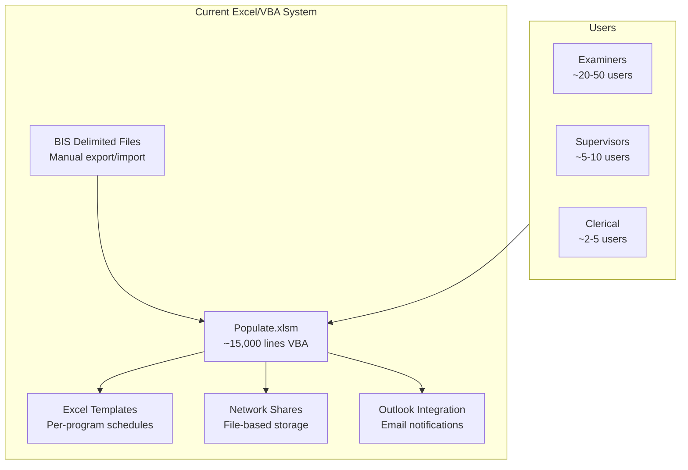

### Current System Strengths

| Strength | Description |
|----------|-------------|
| **Familiarity** | Staff know Excel; minimal training needed |
| **Flexibility** | Easy to modify formulas and layouts |
| **No Infrastructure** | Runs on existing workstations |
| **Offline Capable** | Works without network (except save) |
| **Low Cost** | No licensing beyond Office |

### Current System Weaknesses

| Weakness | Impact | Severity |
|----------|--------|----------|
| **Single-User Files** | No concurrent editing; file locking | High |
| **No Central Database** | Data scattered across files; hard to aggregate | High |
| **Performance Issues** | Slow population; cell-by-cell I/O | Medium |
| **Version Control** | Different examiners may have different macro versions | High |
| **Fragile Automation** | VBA breaks with Office updates | Medium |
| **Limited Reporting** | Manual aggregation for management reports | Medium |
| **Audit Trail** | Minimal tracking of changes | Medium |
| **Security** | Password protection is weak; code visible | Medium |
| **Scalability** | Degrades with more users/reviews | High |
| **Mobile Access** | None; desktop Excel required | Low |

### Current System Metrics

| Metric | Estimate |
|--------|----------|
| **Active Users** | 30-60 |
| **Reviews/Month** | 200-500 |
| **Programs Supported** | 6 (SNAP±, TANF, GA, MA±) |
| **Lines of VBA Code** | ~15,000 |
| **Files Generated/Year** | 2,400-6,000 schedules |
| **Data Entry Fields/Review** | 100-300 depending on program |

---

## Functional Requirements

### Core Functions to Replicate

#### 1. Data Import (BIS Integration)

**Current:** Manual file selection, VBA parsing

**Requirements:**
- [ ] Upload and parse BIS delimited files (pipe/tab)
- [ ] Support Case and Individual record structures
- [ ] Validate file format before import
- [ ] Handle multiple file formats
- [ ] **Enhancement:** Direct database/API integration with BIS

#### 2. Schedule Population

**Current:** VBA copies data to Excel templates

**Requirements:**
- [ ] Create new reviews with auto-populated fields
- [ ] Program-specific templates (SNAP±, TANF, GA, MA±/PE)
- [ ] Code translations (relationship, race, citizenship, etc.)
- [ ] Date format conversions
- [ ] Element tracking (110-343)
- [ ] Household member management (up to 12 people)
- [ ] Income entry and calculations

#### 3. Data Entry Interface

**Current:** Excel cells with validation

**Requirements:**
- [ ] Form-based data entry with validation
- [ ] Dropdown lists for coded fields
- [ ] Auto-calculation of derived fields
- [ ] Section navigation (I-VII per program)
- [ ] Save draft capability
- [ ] Data type enforcement

#### 4. Computation Sheets

**Current:** Excel formulas on computation sheets

**Requirements:**
- [ ] SNAP benefit calculation
- [ ] TANF benefit calculation
- [ ] GA proration formulas
- [ ] MA eligibility determination
- [ ] Income frequency conversions
- [ ] Multiple scenario comparison

#### 5. Edit Checking / Validation

**Current:** VBA validation with MsgBox errors

**Requirements:**
- [ ] Program-specific validation rules (~50 per program)
- [ ] Cross-field consistency checks
- [ ] Required field enforcement
- [ ] Date logic validation
- [ ] Household composition rules
- [ ] Income/employment consistency
- [ ] Real-time validation vs. submit-time

#### 6. Document Generation

**Current:** VBA generates Word/Excel docs from templates

**Requirements:**
- [ ] Findings Memo generation
- [ ] Appointment letters (English/Spanish)
- [ ] QC14 series memos
- [ ] Information memos
- [ ] CAO request forms
- [ ] PDF export capability
- [ ] **Enhancement:** E-signature integration

#### 7. Workflow Management

**Current:** Email notifications + folder routing

**Requirements:**
- [ ] Examiner → Supervisor → Clerical workflow
- [ ] Return to examiner with comments
- [ ] Status tracking (In Progress, Submitted, Approved, Returned)
- [ ] Email notifications
- [ ] Approval timestamps
- [ ] **Enhancement:** Dashboard views

#### 8. File/Case Management

**Current:** Network folder structure by examiner/program

**Requirements:**
- [ ] Centralized case database
- [ ] Search by review number, examiner, date, status
- [ ] Case history/audit trail
- [ ] Archive management
- [ ] **Enhancement:** Bulk operations

#### 9. Reporting

**Current:** Manual aggregation

**Requirements:**
- [ ] Error rate reports by program/examiner
- [ ] Timeliness tracking
- [ ] Workload distribution
- [ ] FFY (Federal Fiscal Year) reporting
- [ ] Export to Excel/CSV
- [ ] **Enhancement:** Real-time dashboards

### Non-Functional Requirements

| Requirement | Specification |
|-------------|---------------|
| **Availability** | 99% uptime during business hours |
| **Performance** | Page load < 3 seconds; population < 5 seconds |
| **Concurrent Users** | 50+ simultaneous users |
| **Data Retention** | 7 years per federal requirements |
| **Accessibility** | WCAG 2.1 AA compliance |
| **Security** | Role-based access; encrypted data; audit logs |
| **Compatibility** | Modern browsers (Chrome, Edge, Firefox) |
| **Offline Support** | Optional; for field work |

---

## Technology Options

### Option 1: Web Application

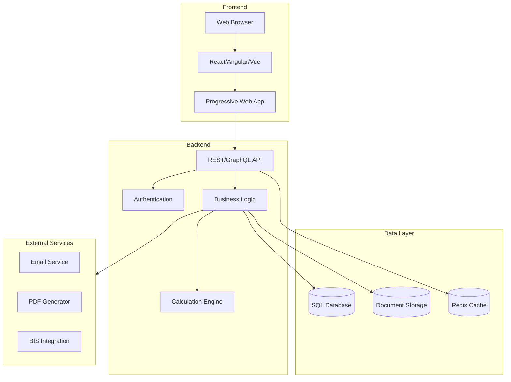

**Technology Stack Options:**

| Layer | Option A (Microsoft) | Option B (Open Source) | Option C (Low-Code) |
|-------|---------------------|------------------------|---------------------|
| Frontend | Blazor WebAssembly | React + TypeScript | Power Apps |
| Backend | ASP.NET Core | Node.js / Python FastAPI | Power Automate |
| Database | SQL Server | PostgreSQL | Dataverse |
| Auth | Azure AD | Auth0 / Keycloak | Azure AD |
| Hosting | Azure App Service | AWS/GCP/On-Prem | Microsoft 365 |
| Docs | SharePoint | S3/MinIO | SharePoint |

**Pros:**
- ✅ Accessible from any device with browser
- ✅ Centralized data and code
- ✅ Real-time collaboration possible
- ✅ Easy to update (deploy once)
- ✅ Modern UI/UX capabilities
- ✅ Integrates with cloud services

**Cons:**
- ❌ Requires server infrastructure
- ❌ Network dependency
- ❌ Higher initial development cost
- ❌ Learning curve for users

### Option 2: Desktop Application

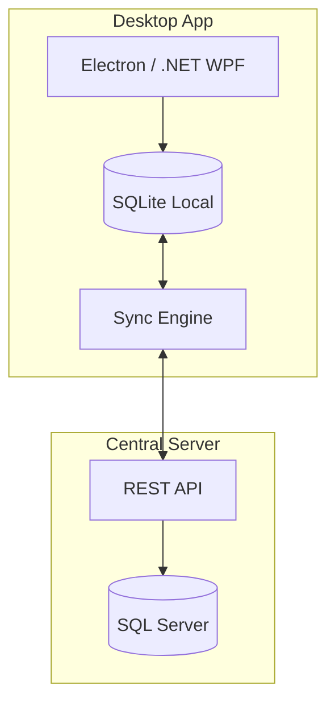

**Technology Stack Options:**

| Layer | Option A (Electron) | Option B (.NET) |
|-------|--------------------:|-----------------|
| Framework | Electron + React | WPF / WinUI 3 |
| Language | TypeScript | C# |
| Local DB | SQLite | SQLite / LiteDB |
| Installer | NSIS / MSI | ClickOnce / MSIX |

**Pros:**
- ✅ Works offline by default
- ✅ Native performance
- ✅ Similar to current Excel experience
- ✅ No browser compatibility issues

**Cons:**
- ❌ Installation/update management
- ❌ Multiple versions in use
- ❌ Platform-specific (Windows)
- ❌ Harder to maintain

### Option 3: Hybrid (PWA + Offline)

**Best of Both Worlds:**

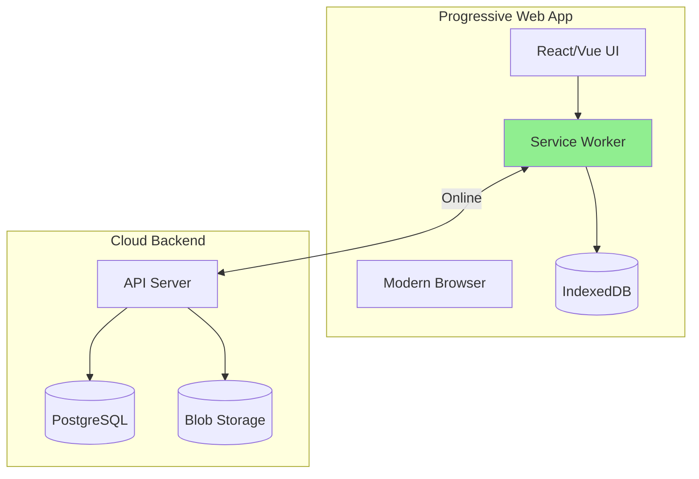

**Key Features:**
- Service Worker caches app and data
- IndexedDB stores local data
- Sync when online
- Installable on desktop/mobile

**Pros:**
- ✅ Web deployment simplicity
- ✅ Works offline (PWA)
- ✅ Cross-platform
- ✅ Modern capabilities

**Cons:**
- ⚠️ More complex to implement
- ⚠️ Storage limits in browsers
- ⚠️ Sync conflict resolution needed

### Option 4: Low-Code Platform (Power Platform)

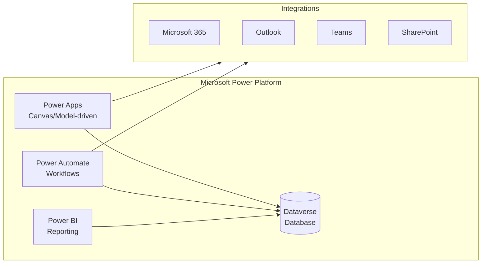

**Pros:**
- ✅ Fastest development time
- ✅ Integrates with existing Microsoft stack
- ✅ Low coding required
- ✅ Built-in mobile support
- ✅ AI Builder for OCR/automation

**Cons:**
- ❌ Licensing costs (per user)
- ❌ Limited customization
- ❌ Vendor lock-in
- ❌ Performance for complex calculations
- ❌ Formula language learning curve

### Technology Comparison Matrix

| Criteria | Web App | Desktop | PWA Hybrid | Power Platform |
|----------|:-------:|:-------:|:----------:|:--------------:|
| **Development Time** | Medium | Long | Medium-Long | Short |
| **Initial Cost** | Medium | High | Medium-High | Low-Medium |
| **Ongoing Cost** | Low | Medium | Low | Medium-High |
| **Offline Support** | ❌ | ✅ | ✅ | ⚠️ Limited |
| **Multi-platform** | ✅ | ❌ | ✅ | ✅ |
| **Customization** | ✅✅ | ✅✅ | ✅✅ | ⚠️ |
| **Maintenance** | Easy | Hard | Medium | Easy |
| **Complex Calcs** | ✅ | ✅ | ✅ | ⚠️ |
| **Integration** | ✅ | ✅ | ✅ | ✅✅ |
| **User Training** | Medium | Low | Medium | Medium |

---

## Recommended Architecture

### Primary Recommendation: Web Application with PWA Capabilities

Based on the analysis, a **web-based application with Progressive Web App (PWA) features** provides the best balance of:
- Modern development practices
- Centralized management
- Offline capability when needed
- Cross-device access
- Future extensibility

### Proposed Architecture

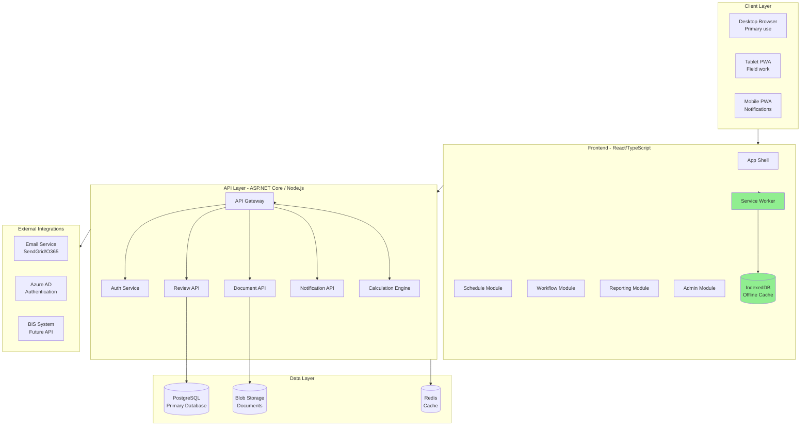

### Database Schema (Simplified)

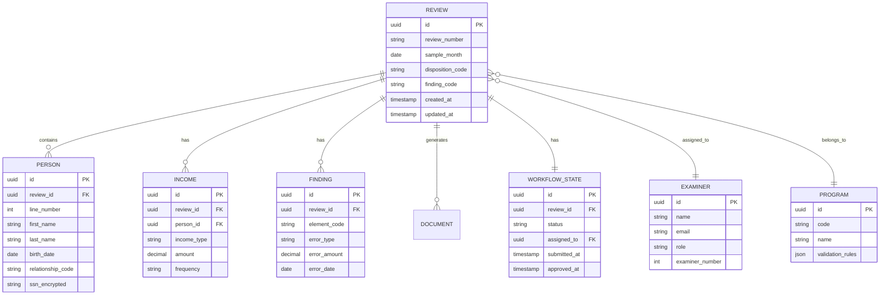

### Key Components

#### 1. Frontend (React + TypeScript)

```
src/
├── components/
│   ├── schedule/
│   │   ├── ScheduleForm.tsx
│   │   ├── SectionI.tsx
│   │   ├── SectionII.tsx
│   │   ├── HouseholdTable.tsx
│   │   └── IncomeEntry.tsx
│   ├── workflow/
│   │   ├── ReviewQueue.tsx
│   │   ├── ApprovalPanel.tsx
│   │   └── CommentThread.tsx
│   ├── documents/
│   │   ├── MemoGenerator.tsx
│   │   └── DocumentViewer.tsx
│   └── common/
│       ├── CodeDropdown.tsx
│       ├── DatePicker.tsx
│       └── ValidationMessage.tsx
├── services/
│   ├── api.ts
│   ├── auth.ts
│   ├── offline.ts
│   └── calculations.ts
├── hooks/
│   ├── useReview.ts
│   ├── useValidation.ts
│   └── useOfflineSync.ts
└── utils/
    ├── codeTranslations.ts
    ├── dateFormatters.ts
    └── validators.ts
```

#### 2. Calculation Engine

Replicate Excel formulas in code:

```typescript
// services/calculations.ts

export function calculateSNAPBenefit(household: Household): BenefitResult {
  const grossIncome = sumGrossIncome(household);
  const netIncome = calculateNetIncome(household, grossIncome);
  const maxAllotment = getMaxAllotment(household.size);
  const thirtyPercentRule = Math.round(netIncome * 0.3);
  const benefit = Math.max(0, maxAllotment - thirtyPercentRule);
  
  return {
    grossIncome,
    netIncome,
    maxAllotment,
    benefit,
    calculations: [...] // Audit trail
  };
}

export function calculateGAProration(
  benefit: number, 
  days: number
): number {
  // Port GA proration formula from GAcompsheet()
  const hundredInterval = Math.floor((benefit - 1) / 100);
  const remainder = benefit - (100 * hundredInterval);
  
  // Day-specific multipliers from original VBA
  const multipliers: Record<number, [number, number]> = {
    1: [6.6, 0.065710554],
    2: [13.1, 0.131430335],
    // ... all 14 days
  };
  
  const [base, factor] = multipliers[days] || [0, 0];
  return base * hundredInterval + Math.round(factor * remainder * 10) / 10;
}
```

#### 3. Validation Engine

Port edit checking rules:

```typescript
// services/validation.ts

interface ValidationRule {
  id: string;
  program: Program[];
  field: string;
  condition: (review: Review) => boolean;
  message: string;
  severity: 'error' | 'warning';
}

const rules: ValidationRule[] = [
  {
    id: 'SNAP_ABAWD_AGE',
    program: ['SNAP_POSITIVE'],
    field: 'section4.abawdStatus',
    condition: (r) => r.persons.every(p => 
      p.snapParticipant && 
      (p.age >= 18 && p.age < 50) || 
      p.abawdStatus === 9
    ),
    message: 'ABAWD status must be 9 (exempt) for persons outside 18-49 age range',
    severity: 'error'
  },
  // ... 150+ rules from Module3.vba
];

export function validateReview(review: Review): ValidationResult[] {
  const programRules = rules.filter(r => 
    r.program.includes(review.program)
  );
  
  return programRules
    .filter(rule => !rule.condition(review))
    .map(rule => ({
      ruleId: rule.id,
      field: rule.field,
      message: rule.message,
      severity: rule.severity
    }));
}
```

#### 4. Document Generation

Use templating library for memos:

```typescript
// services/documents.ts

import { PDFDocument, StandardFonts } from 'pdf-lib';
import Handlebars from 'handlebars';

export async function generateFindingsMemo(
  review: Review,
  template: 'SNAP' | 'TANF' | 'MA' | 'GA'
): Promise<Uint8Array> {
  const templateContent = await loadTemplate(template);
  const compiled = Handlebars.compile(templateContent);
  
  const data = {
    reviewNumber: review.reviewNumber,
    sampleMonth: formatMonth(review.sampleMonth),
    examinerName: review.examiner.name,
    findings: review.findings.map(formatFinding),
    errorAmount: calculateTotalError(review),
    // ... other fields
  };
  
  const html = compiled(data);
  return await generatePDF(html);
}
```

### Deployment Architecture

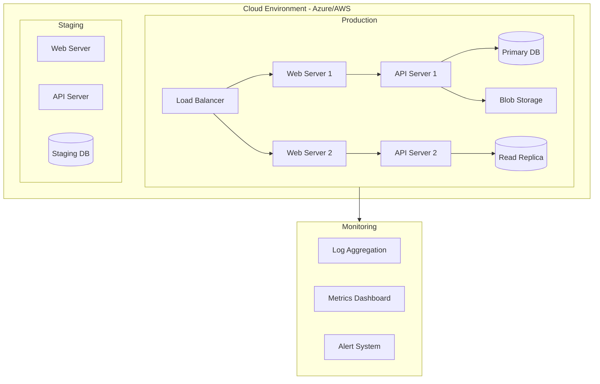

---

## Migration Strategy

### Phase 1: Foundation (Months 1-3)

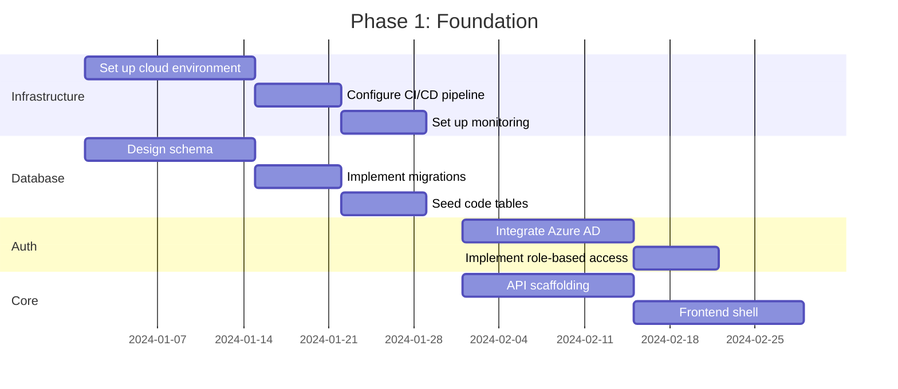

**Deliverables:**
- [ ] Cloud infrastructure provisioned
- [ ] Database schema implemented
- [ ] Authentication working
- [ ] Basic API endpoints
- [ ] Frontend shell with routing

### Phase 2: Core Features (Months 4-8)

**Focus:** Replicate current functionality

| Sprint | Features | Duration |
|--------|----------|----------|
| Sprint 1 | BIS file import, parsing | 2 weeks |
| Sprint 2 | Review creation, population | 2 weeks |
| Sprint 3 | SNAP Positive schedule | 3 weeks |
| Sprint 4 | SNAP Negative schedule | 2 weeks |
| Sprint 5 | TANF/GA schedules | 3 weeks |
| Sprint 6 | MA Positive schedule | 3 weeks |
| Sprint 7 | MA Negative/PE schedules | 2 weeks |
| Sprint 8 | Computation engine | 3 weeks |
| Sprint 9 | Edit checking | 3 weeks |
| Sprint 10 | Document generation | 2 weeks |

**Deliverables:**
- [ ] All 6 program types functional
- [ ] Validation rules ported
- [ ] Calculations verified against Excel
- [ ] Basic document generation

### Phase 3: Workflow & Polish (Months 9-12)

| Sprint | Features | Duration |
|--------|----------|----------|
| Sprint 11 | Workflow engine | 2 weeks |
| Sprint 12 | Email notifications | 1 week |
| Sprint 13 | Approval process | 2 weeks |
| Sprint 14 | Reporting dashboard | 2 weeks |
| Sprint 15 | Offline PWA | 3 weeks |
| Sprint 16 | Admin features | 2 weeks |
| Sprint 17 | Bug fixes, polish | 2 weeks |
| Sprint 18 | Performance optimization | 2 weeks |

**Deliverables:**
- [ ] Complete workflow management
- [ ] Email integration
- [ ] Management reports
- [ ] Offline capability
- [ ] Admin console

### Phase 4: Migration & Rollout (Months 13-18)

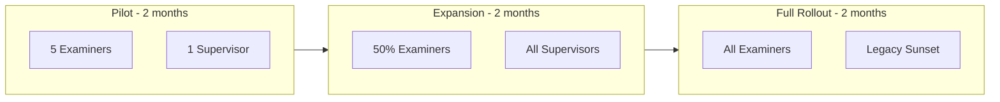

**Activities:**
1. **Data Migration**
   - Export historical schedules to new database
   - Validate data integrity
   - Map old file references

2. **Parallel Operation**
   - Run both systems simultaneously
   - Compare outputs
   - Fix discrepancies

3. **Training**
   - User guides and videos
   - Hands-on workshops
   - Super-user certification

4. **Support**
   - Dedicated help desk
   - Bug triage process
   - Feedback collection

---

## Cost-Benefit Analysis

### Development Costs

| Category | Low Estimate | High Estimate | Notes |
|----------|-------------|---------------|-------|
| **Development Team** | | | 12-18 months |
| - Full-stack developers (2) | $200,000 | $360,000 | $100-150K/year each |
| - UI/UX designer (0.5) | $50,000 | $75,000 | Part-time |
| - QA engineer (1) | $80,000 | $120,000 | Full-time |
| - Project manager (0.5) | $50,000 | $75,000 | Part-time |
| **Subtotal Labor** | **$380,000** | **$630,000** | |
| | | | |
| **Infrastructure** | | | Annual |
| - Cloud hosting (Azure/AWS) | $12,000 | $36,000 | Depends on scale |
| - Database (managed) | $6,000 | $18,000 | |
| - Monitoring/logging | $2,400 | $6,000 | |
| - SSL/security | $1,200 | $3,000 | |
| **Subtotal Infra (Year 1)** | **$21,600** | **$63,000** | |
| | | | |
| **Other Costs** | | | |
| - Training development | $10,000 | $25,000 | |
| - Documentation | $5,000 | $15,000 | |
| - Contingency (15%) | $62,490 | $109,950 | |
| | | | |
| **Total First Year** | **$479,090** | **$842,950** | |

### Ongoing Costs (Annual)

| Category | Low Estimate | High Estimate |
|----------|-------------|---------------|
| Maintenance developer (0.5) | $50,000 | $75,000 |
| Infrastructure | $21,600 | $63,000 |
| Support staff | $20,000 | $40,000 |
| **Total Annual** | **$91,600** | **$178,000** |

### Current System Costs (Hidden)

| Category | Estimate | Notes |
|----------|----------|-------|
| Staff time on workarounds | $30,000/year | Estimated 2 hrs/week × 30 staff |
| File management overhead | $15,000/year | Organizing, finding, fixing files |
| Report aggregation | $20,000/year | Manual compilation |
| Training new staff | $10,000/year | Complex system knowledge transfer |
| Error correction | $25,000/year | Finding and fixing mistakes |
| **Total Hidden Cost** | **$100,000/year** | Conservative estimate |

### Benefit Quantification

| Benefit | Value | Calculation |
|---------|-------|-------------|
| **Efficiency Gains** | $75,000/year | 30% faster reviews × 400/month |
| **Reduced Errors** | $30,000/year | Fewer rework cycles |
| **Better Reporting** | $20,000/year | Automated vs. manual |
| **Compliance** | Risk mitigation | Audit trail, consistency |
| **Scalability** | Strategic | Handle growth without degradation |
| **Total Quantifiable** | **$125,000/year** | |

### ROI Calculation

```
Initial Investment: ~$650,000 (midpoint)
Annual Benefit: ~$125,000
Annual Ongoing Cost: ~$135,000 (midpoint)
Net Annual Benefit: $125,000 - $135,000 + $100,000 (hidden savings) = $90,000

Payback Period: $650,000 / $90,000 = ~7.2 years
```

**Note:** ROI improves significantly if:
- Team productivity increases more than estimated
- System enables new capabilities (mobile, remote work)
- Federal reporting requirements expand
- Number of reviews increases

### Alternative: Power Platform Costs

| Category | Year 1 | Annual Ongoing |
|----------|--------|----------------|
| Power Apps licenses (50 users × $20/mo) | $12,000 | $12,000 |
| Dataverse capacity | $2,400 | $2,400 |
| Power Automate | $3,000 | $3,000 |
| Development (faster) | $200,000 | - |
| Customization limits workarounds | $50,000 | $25,000 |
| **Total** | **$267,400** | **$42,400** |

Power Platform is cheaper initially but has higher ongoing licensing and may hit capability limits.

---

## Risk Assessment

### Technical Risks

| Risk | Likelihood | Impact | Mitigation |
|------|------------|--------|------------|
| Calculation discrepancies | Medium | High | Extensive parallel testing with Excel |
| Performance issues | Low | Medium | Load testing; optimization phase |
| Integration failures | Medium | Medium | API documentation; fallback imports |
| Data migration errors | Medium | High | Staged migration; validation scripts |
| Offline sync conflicts | Medium | Medium | Conflict resolution UI; last-write-wins |

### Operational Risks

| Risk | Likelihood | Impact | Mitigation |
|------|------------|--------|------------|
| User resistance | High | High | Early involvement; change champions |
| Training gaps | Medium | Medium | Comprehensive training program |
| Parallel operation burden | Medium | Low | Minimize overlap period |
| Support overwhelm | Medium | Medium | Phased rollout; super-users |
| Key person departure | Low | High | Documentation; cross-training |

### Organizational Risks

| Risk | Likelihood | Impact | Mitigation |
|------|------------|--------|------------|
| Budget cuts mid-project | Medium | Critical | Phased deliverables; show early wins |
| Scope creep | High | Medium | Strict change control; MVP focus |
| Changing requirements | Medium | Medium | Agile approach; regular demos |
| Political resistance | Low | Medium | Executive sponsorship; transparency |

### Risk Heat Map

```
                    IMPACT
                 Low    Med    High
           ┌────────┬────────┬────────┐
    High   │ Scope  │ User   │        │
LIKELIHOOD │ Creep  │Resist. │        │
           ├────────┼────────┼────────┤
    Med    │Parallel│ Train  │ Calc   │
           │Burden  │ Gaps   │ Errors │
           ├────────┼────────┼────────┤
    Low    │        │Perform.│ Budget │
           │        │        │ Cuts   │
           └────────┴────────┴────────┘
```

### Risk Mitigation Strategies

**For High-Impact Risks:**

1. **Calculation Discrepancies**
   - Create test suite with 100+ historical cases
   - Compare new vs. Excel output field-by-field
   - Run parallel for 1+ month before cutover
   - Maintain Excel as backup during pilot

2. **User Resistance**
   - Include examiners in design sessions
   - Identify change champions per office
   - Demonstrate clear benefits (speed, mobile)
   - Preserve familiar terminology and workflows
   - Provide extensive training and support

3. **Budget Cuts**
   - Deliver in phases with usable increments
   - MVP covers core population + validation
   - Each phase provides standalone value
   - Document savings at each milestone

---

## Implementation Timeline

### Gantt Chart

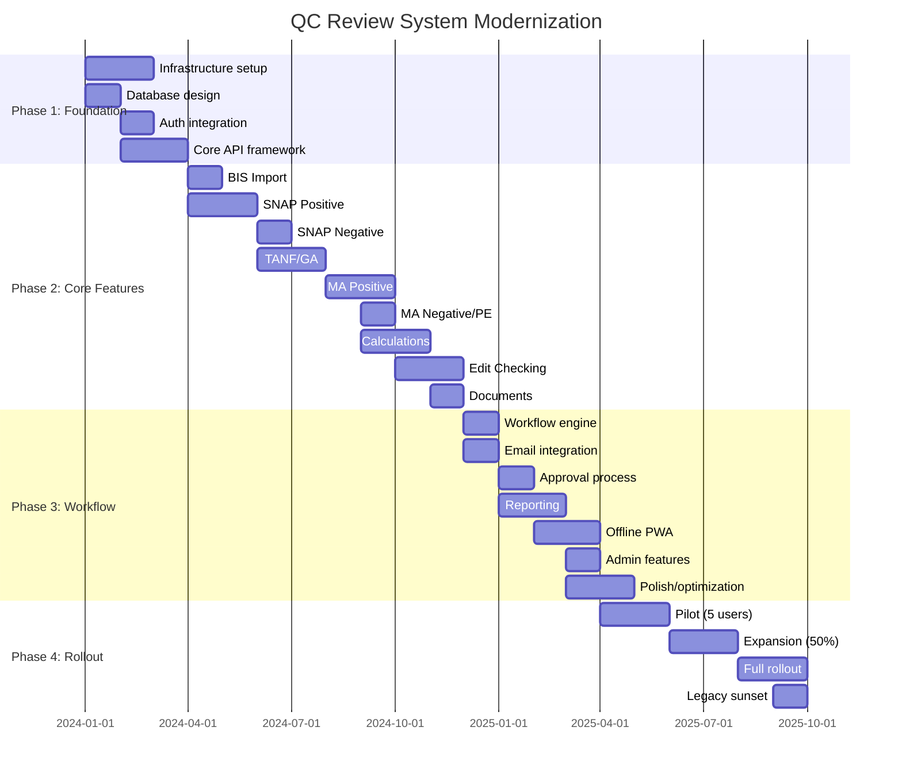

### Milestone Checkpoints

| Milestone | Target Date | Success Criteria |
|-----------|-------------|------------------|
| M1: Infrastructure Ready | Month 2 | CI/CD working, auth functional |
| M2: First Schedule Type | Month 5 | SNAP Positive creates reviews |
| M3: All Schedule Types | Month 10 | All 6 programs functional |
| M4: Workflow Complete | Month 14 | Full examiner→supervisor flow |
| M5: Pilot Launch | Month 16 | 5 users in production |
| M6: Full Rollout | Month 18 | All staff migrated |

---

## Recommendations

### Primary Recommendation

**Proceed with web application development using a phased approach.**

**Rationale:**
1. Current system has fundamental scalability and maintainability issues
2. Web-based solution addresses all critical weaknesses
3. PWA capabilities provide offline needs without desktop complexity
4. Phased approach manages risk and allows course corrections
5. Long-term cost savings outweigh initial investment

### Technology Recommendations

| Component | Recommendation | Rationale |
|-----------|----------------|-----------|
| **Frontend** | React + TypeScript | Large ecosystem, strong typing, PWA support |
| **Backend** | ASP.NET Core or Node.js | Depends on team expertise; both viable |
| **Database** | PostgreSQL | Open source, full-featured, great performance |
| **Hosting** | Azure | Existing Microsoft relationship; AD integration |
| **Auth** | Azure AD | Leverage existing credentials |
| **Documents** | PDF-lib + Handlebars | Client-side generation; no server load |

### Alternative Recommendation

**If budget is constrained:** Consider Power Platform for Phase 1

- Faster time to value (6 months vs. 18)
- Lower initial investment (~$250K vs. ~$650K)
- Acceptable for core CRUD operations
- May need custom code for complex calculations
- Evaluate after 1 year for custom development needs

### Key Success Factors

1. **Executive Sponsorship**
   - Visible leadership support
   - Protected budget
   - Authority to make decisions

2. **User Involvement**
   - Include examiners in design
   - Regular feedback loops
   - Change champion network

3. **Realistic Expectations**
   - MVP before enhancements
   - Perfect is enemy of good
   - Iterate based on use

4. **Technical Excellence**
   - Experienced developers
   - Thorough testing
   - Performance focus

5. **Change Management**
   - Clear communication plan
   - Training investment
   - Support structure

### Decision Matrix

| Option | Score | Recommendation |
|--------|-------|----------------|
| **Do Nothing** | 2/10 | ❌ Not recommended - issues will worsen |
| **Optimize VBA** | 4/10 | ⚠️ Band-aid; fundamental issues remain |
| **Power Platform** | 6/10 | ✅ Good if budget/time constrained |
| **Web Application** | 8/10 | ✅ Best long-term solution |
| **Desktop Application** | 5/10 | ❌ Deployment complexity outweighs benefits |

### Next Steps

If proceeding:

1. **Secure Funding**
   - Present business case to leadership
   - Identify budget source
   - Get commitment for full project

2. **Build Team**
   - Hire/assign developers
   - Identify project manager
   - Establish governance

3. **Detailed Planning**
   - Requirements workshops with users
   - Technical architecture refinement
   - Detailed project schedule

4. **Proof of Concept**
   - Build SNAP Positive in 6-8 weeks
   - Validate approach with real users
   - Refine estimates based on learnings

5. **Begin Phase 1**
   - Infrastructure setup
   - Database design
   - Authentication integration

---

## Appendix A: Feature Comparison

| Feature | Current VBA | Web App | Power Platform |
|---------|:-----------:|:-------:|:--------------:|
| Multi-user editing | ❌ | ✅ | ✅ |
| Centralized data | ❌ | ✅ | ✅ |
| Offline support | ✅ | ⚠️ PWA | ⚠️ Limited |
| Mobile access | ❌ | ✅ | ✅ |
| Real-time collaboration | ❌ | ✅ | ✅ |
| Complex calculations | ✅ | ✅ | ⚠️ |
| Custom validation | ✅ | ✅ | ⚠️ |
| Document generation | ✅ | ✅ | ⚠️ |
| Workflow automation | ⚠️ Manual | ✅ | ✅ |
| Reporting dashboard | ❌ | ✅ | ✅ |
| Audit trail | ⚠️ Limited | ✅ | ✅ |
| Version control | ❌ | ✅ | ✅ |
| API integration | ❌ | ✅ | ✅ |
| Customization | ✅ VBA | ✅ Code | ⚠️ Limited |

## Appendix B: Glossary

| Term | Definition |
|------|------------|
| **ABAWD** | Able-Bodied Adult Without Dependents |
| **BIS** | Benefits Information System |
| **CAO** | County Assistance Office |
| **ETP** | Employment and Training Program |
| **FFY** | Federal Fiscal Year (October-September) |
| **GA** | General Assistance |
| **LIHEAP** | Low Income Home Energy Assistance Program |
| **MA** | Medical Assistance (Medicaid) |
| **PE** | Presumptive Eligibility |
| **PWA** | Progressive Web Application |
| **QC** | Quality Control |
| **QCMIS** | QC Management Information System |
| **SNAP** | Supplemental Nutrition Assistance Program |
| **SUA** | Standard Utility Allowance |
| **TANF** | Temporary Assistance for Needy Families |

---

## Document Information

| Attribute | Value |
|-----------|-------|
| Version | 1.0 |
| Created | January 2, 2026 |
| Author | Documentation Analysis |
| Status | Draft for Review |
| Next Review | Upon funding decision |

---

*This feasibility analysis should be reviewed with IT leadership, program management, and finance before making implementation decisions.*

